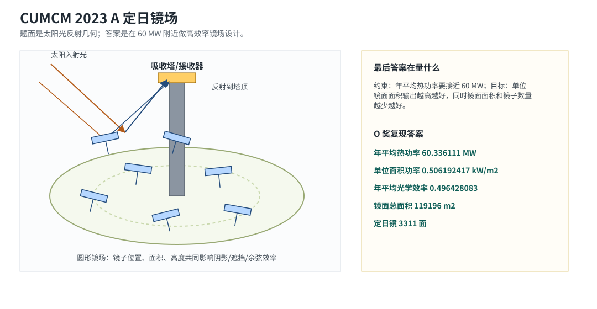
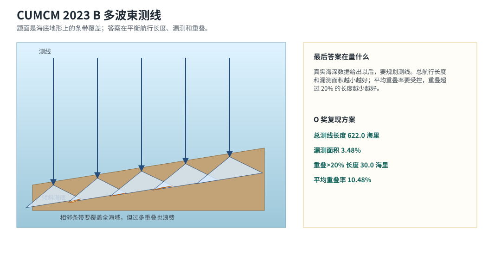
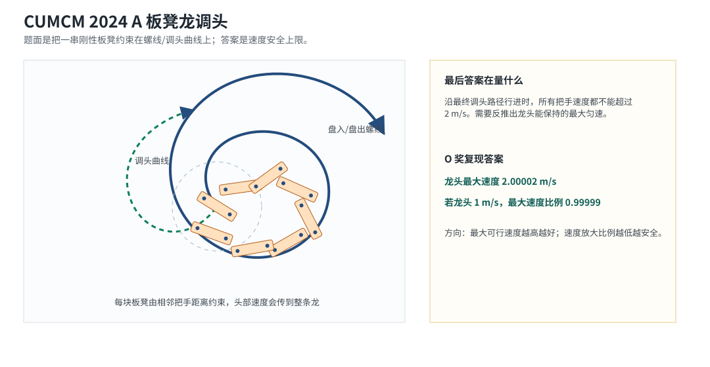
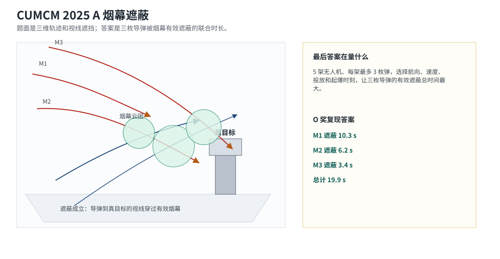
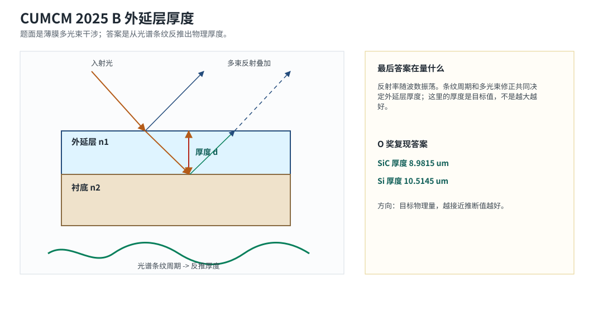
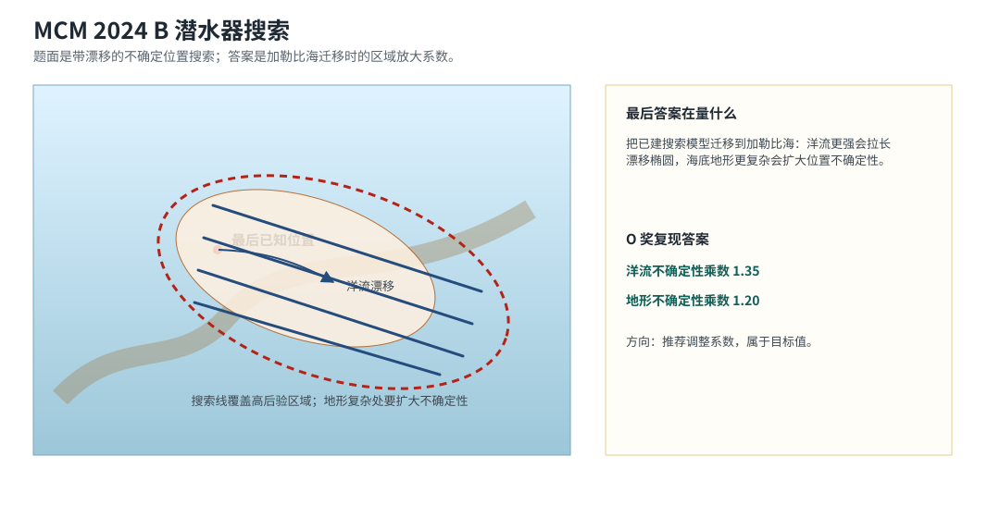
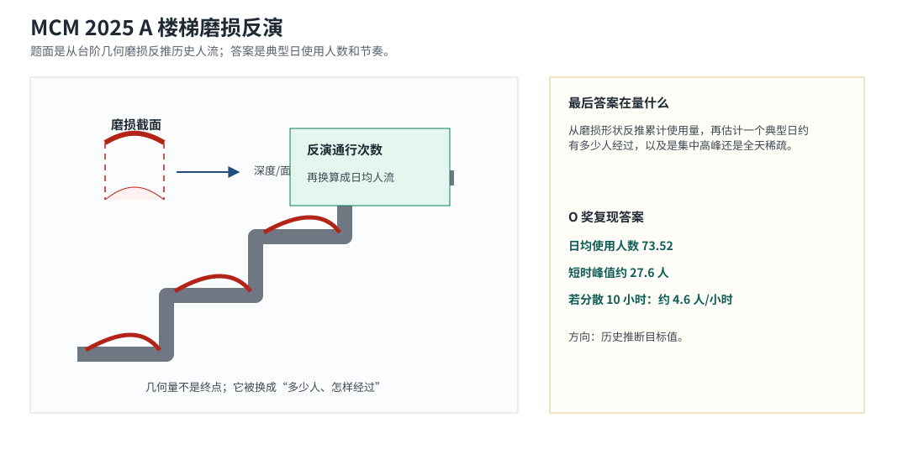

# Geometry Visual Guide

This guide adds quick visual intuition for the spatial or geometry-heavy TB-MathModeling tasks. Each figure connects the contest problem geometry to the final numeric answer currently used by the verifier.

The figures are intentionally schematic: they explain what is being modeled and scored, not the exact coordinates from any one contest attachment.

## CUMCM 2023 A 定日镜场

- Task: `cumcm-2023-a-heliostat-field`
- Problem: 在定日镜尺寸和安装高度都可以变化时，重新设计镜场，在满足约 60 MW 年平均输出功率的同时，让单位镜面面积输出尽量大。
- Final verifier answer: 年平均热功率 60.336111 MW；单位面积功率 0.506192417 kW/m2；光学效率 0.496428083；镜面总面积 119196 m2；定日镜 3311 面。
- Baseline model idea: 几何解析 + 太阳运动参数方程 + 镜场约束估计。
- Reading hint: 看反射光线：镜场不是只求发电多，而是在满足约 60 MW 的同时，让单位面积更有效。

## CUMCM 2023 B 多波束测线

- Task: `cumcm-2023-b-multibeam-lines`
- Problem: 给定真实海深数据，设计测线方案，尽量减少测线总长度，同时控制漏测面积和重叠过大的测线长度。
- Final verifier answer: 总测线长度 622.0 海里；漏测面积 3.48%；重叠超过 20% 长度 30.0 海里；平均重叠率 10.48%。
- Baseline model idea: 海底地形拟合 + 规则化/贪心测线布置。
- Reading hint: 看条带：测线越少越省，但条带之间不能留下空洞，也不能大量重复扫。

## CUMCM 2024 A 板凳龙调头

- Task: `cumcm-2024-a-dragon-dance`
- Problem: 沿着前面求出的调头路径行进时，求龙头最大能跑多快，才能保证所有把手速度都不超过 2 m/s。
- Final verifier answer: 龙头最大速度约 2.00002 m/s；龙头 1 m/s 时最大速度比例约 0.99999。
- Baseline model idea: 螺线/调头路径参数化 + 刚性把手距离约束 + 速度传播。
- Reading hint: 看整条链：不是只看龙头，任一把手超速都会让方案不可行。

## CUMCM 2025 A 烟幕遮蔽

- Task: `cumcm-2025-a-smoke-screen`
- Problem: 5 架无人机、每架最多 3 枚烟幕弹，同时对 3 枚导弹实施遮蔽，求总体遮蔽时间尽量长的投放方案。
- Final verifier answer: M1 10.3 s；M2 6.2 s；M3 3.4 s；总计 19.9 s。
- Baseline model idea: 轨迹几何 + 投放/起爆时序规划优化。
- Reading hint: 看视线：有效遮蔽就是烟幕云团挡住导弹到真目标的视线。

## CUMCM 2025 B 外延层厚度

- Task: `cumcm-2025-b-sic-thickness`
- Problem: 把多光束反射/透射造成的干涉也考虑进去，重新确定碳化硅外延层厚度，并分析结果可靠性。
- Final verifier answer: SiC 厚度 8.9815 um；Si 厚度 10.5145 um。
- Baseline model idea: 光谱条纹周期拟合 + 多光束干涉修正。
- Reading hint: 看薄膜：多束反射叠加形成条纹，条纹周期编码了层厚。

## MCM 2024 B 潜水器搜索

- Task: `mcm-2024-b-submersible-search`
- Problem: 把潜水器搜索模型迁移到加勒比海场景，并说明洋流、海底地形和多潜水器协同时需要怎样调整。
- Final verifier answer: 洋流不确定性乘数 1.35；地形不确定性乘数 1.20。
- Baseline model idea: 贝叶斯后验位置 + 洋流/地形不确定性放大 + 搜索覆盖规划。
- Reading hint: 看椭圆：乘数不是目标收益，而是在不同海域下把搜索不确定性放大。

## MCM 2025 A 楼梯磨损反演

- Task: `mcm-2025-a-stair-wear`
- Problem: 根据楼梯磨损反推典型一天大约多少人使用，以及这些人是短时间集中经过还是长时间稀疏经过。
- Final verifier answer: 日均使用人数 73.52；短时峰值约 27.6 人；分散到 10 小时则约 4.6 人/小时。
- Baseline model idea: 物理磨损反演 + 材料/年龄假设 + 使用模式换算。
- Reading hint: 看截面：几何磨损被转换成累计通行，再转换成典型日人流。
