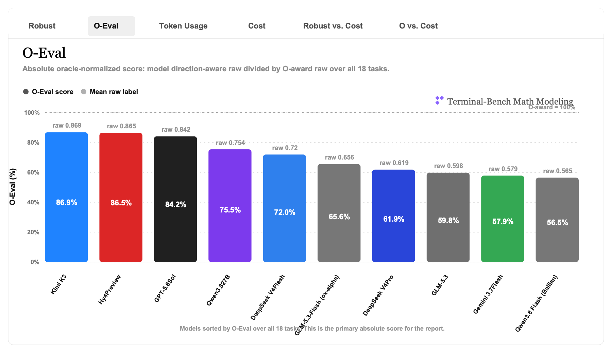
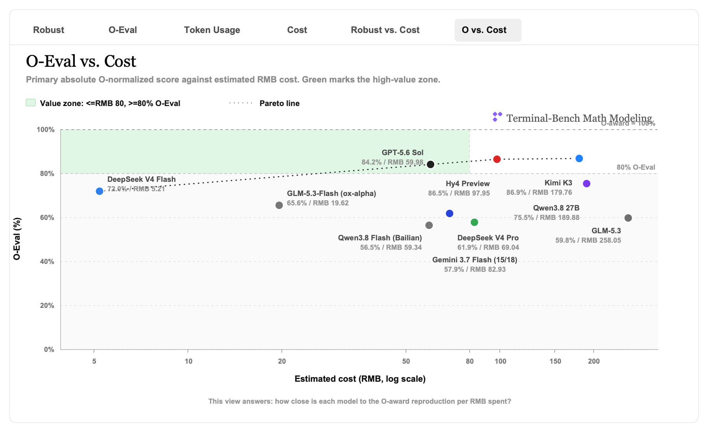
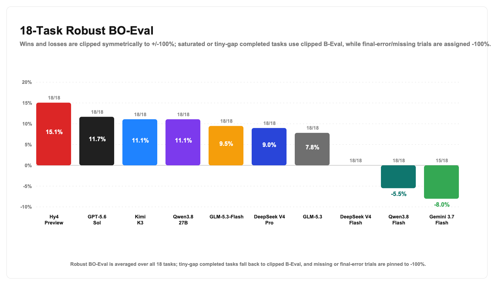
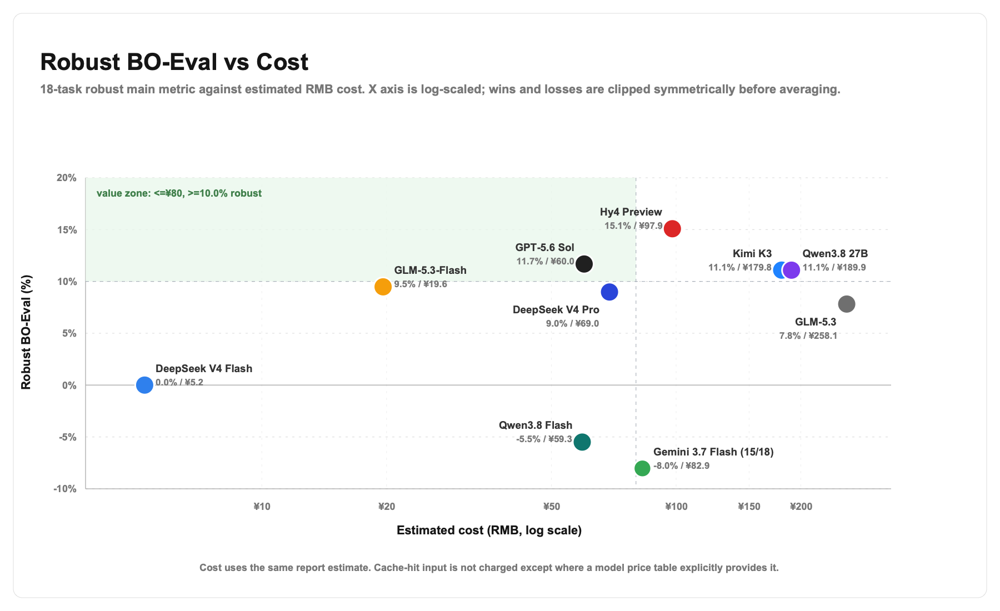
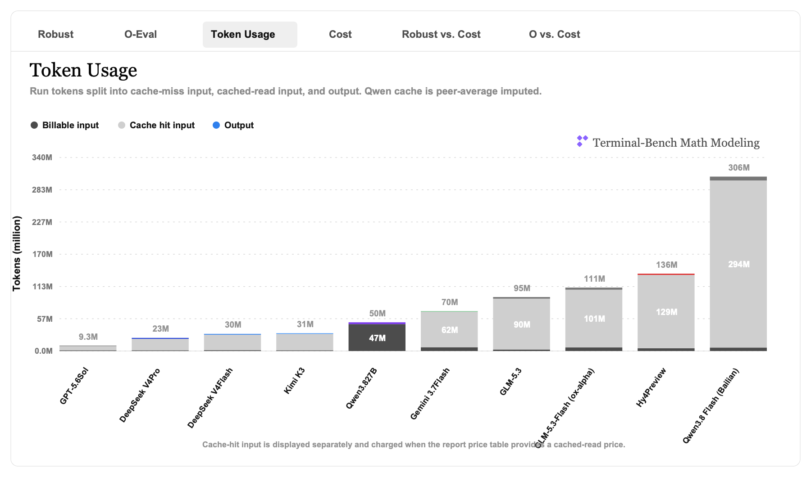
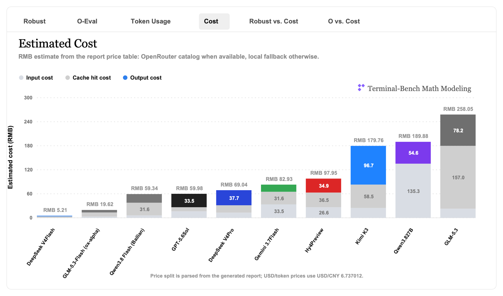

# 用大白话看 terminal-bench-math-modeling 的 18 题 O-Eval / Robust BO-Eval

生成日期：2026-09-02

这篇文章解释 2023、2024、2025 三年共 18 道 terminal-bench-math-modeling 题。它不重新跑模型，只读取已经保存的 artifact，再用同一套 direction-aware scoring 重新算 O-Eval 主指标、Robust BO-Eval 辅助指标、token 和粗略成本。

## 先说结论

这个 benchmark 看的不是模型会不会写一篇像样的建模论文，而是：给它完整赛题和附件后，它最后交出来的关键数字，能不能追上优秀论文复现答案。

最终主指标现在是 O-Eval：`模型 direction-aware raw / O raw`，再对 18 题取平均。大白话说，100% 就是平均达到 O 奖复现答案的 raw 水平；80% 就是平均有 O 奖锚点的八成左右。

这也是为什么 O-Eval 和 Robust BO-Eval 会出现排序不一致：O-Eval 看的是离 O 有多近，Robust 看的是比 flash 多追回了多少。一个是绝对分，一个是相对进步分，所以它们是互补的，不是二选一。

18 题总排名按 O-Eval 算是：Kimi K3 (86.88%) > Hy4 Preview (86.52%) > GPT-5.6 Sol (84.16%) > Qwen3.8 27B (75.45%) > ox-alpha (65.59%) > v4 pro (61.87%) > GLM-5.3 (59.82%) > Gemini 3.7 Flash (57.86%) > Qwen3.8 Flash (Bailian) (56.49%)。

Robust BO-Eval 仍然保留做辅助解释：正常题用 `(模型 raw - flash raw) / (O raw - flash raw)`，而且赢很多和输很多都一起截到 ±100%；分母小于 0.10 的已完成题，改用 clipped B-Eval，也就是把 `模型 raw - flash raw` 截到 ±10pp。若 trial 没有产出可评分结果，就直接记 -100%。它回答的是“相对便宜 flash baseline 多追回多少”，并且不会让 841% 这种小分母离群值主导结论。

如果两个排名冲突，论文主榜以 O-Eval 为准，Robust 只做辅榜和解释。GLM-5.3-Flash 和 DeepSeek flash 的差别也属于这一类：一个可能在相对追赶上更猛，另一个可能在绝对接近 O 上更好。

按 Robust 辅助口径排序是：Hy4 Preview (15.08%) > GPT-5.6 Sol (11.68%) > Kimi K3 (11.09%) > Qwen3.8 27B (11.09%) > ox-alpha (9.48%) > v4 pro (8.98%) > GLM-5.3 (7.82%) > Qwen3.8 Flash (Bailian) (-5.50%) > Gemini 3.7 Flash (-8.04%)。

| 模型 | artifacts | 平均 raw | O-Eval 主分 | Robust BO-Eval 辅助 | tokens input/cache/output | 估算成本 |
|---|---:|---:|---:|---:|---:|---:|
| v4 flash | 18/18 | 0.719811 | 71.98% | 0.00% | 28,690,539 / 27,294,080 / 1,368,452 | ¥5.21 |
| Kimi K3 | 18/18 | 0.868798 | 86.88% | 11.09% | 30,146,116 / 28,928,953 / 956,805 | ¥179.76 |
| Hy4 Preview | 18/18 | 0.865183 | 86.52% | 15.08% | 133,731,323 / 128,999,040 / 2,068,825 | ¥97.95 |
| GPT-5.6 Sol | 18/18 | 0.841554 | 84.16% | 11.68% | 8,774,606 / 7,566,848 / 497,473 | ¥59.98 |
| Qwen3.8 27B | 18/18 | 0.754457 | 75.45% | 11.09% | 47,245,909 / 0 / 3,178,409 | ¥189.88 |
| ox-alpha | 18/18 | 0.655886 | 65.59% | 9.48% | 107,726,029 / 101,466,688 / 3,683,366 | ¥19.62 |
| v4 pro | 18/18 | 0.618719 | 61.87% | 8.98% | 21,309,105 / 20,096,768 / 1,748,356 | ¥69.04 |
| GLM-5.3 | 18/18 | 0.598189 | 59.82% | 7.82% | 92,056,972 / 89,637,696 / 2,638,779 | ¥258.05 |
| Gemini 3.7 Flash | 15/18 | 0.57861 | 57.86% | -8.04% | 69,131,259 / 62,497,004 / 705,776 | ¥82.93 |
| Qwen3.8 Flash (Bailian) | 18/18 | 0.564887 | 56.49% | -5.50% | 299,616,972 / 293,563,264 / 6,814,374 | ¥59.34 |

## 图怎么读

第一张图看 O-Eval 主效果；第二张是 O-Eval 分数-cost 图：横轴是估算人民币成本，纵轴是 O-Eval，越靠左上越接近 O 奖、也越省钱。





Robust 图保留下来，用来看“相对 v4 flash baseline 的增益”是不是稳定；token 和成本图用来解释为什么同样分数会有不同价格。失败 trial 现在统一按 -100% 记分，不会再被当成普通小分母题。





token 和成本图用来解释为什么同样 O-Eval 分数会有不同价格。





成本统一优先按 OpenRouter 当前 catalog 里的 `prompt`、`input_cache_read`、`input_cache_write`、`completion` 价格算，再用 USD/CNY=6.737012 转成人民币/百万 tokens。价格快照写在 `openrouter-pricing-used-2023-2025.json`；当前 `result.json` 只有 input/cache/output 三类 token，没有单独的 cache write/create 字段，所以显式缓存创建费用不额外拆账。

按这个口径，Qwen3.8 27B 是 75.45% O-Eval、11.09% Robust 辅助、¥189.88 估算成本；它不会再被 841% 这类小分母离群值抬高。

Kimi K3 是 86.88% O-Eval、11.09% Robust 辅助、¥179.76 估算成本。Kimi 2023 的汇总 `result.json` 已经回到 3 completed / 0 error 的状态，所以这里不会再因为旧 error 计数低估 artifacts。

GLM-5.3-Flash (ox-alpha) 已完成 17/18 个有效任务；`cumcm-2023-a-heliostat-field` 因正常模型推理超时记为最终失败，不再重试。目录级 artifact 记录为 18/18，O-Eval 按可评分的有效结果计算。

Qwen3.8 Flash (Bailian) 有 16/18 个有效完成、2 个正常模型推理超时的最终 error；目录级 artifact 记录为 18/18，错误题不进入有效结果。

Hy4 Preview 已完成 18/18 个有效任务，O-Eval 是 86.52%、Robust 辅助是 15.08%。按 OpenRouter `tencent/hy4-preview` 价格估算成本为 ¥97.95。

## B、O、Agent 各自是什么

为了别把三个角色混在一起，后面的逐题表会把它们拆开：

- **B**：v4 flash baseline 的实际提交答案。它是 Robust 里的便宜参考点，不一定是人工写死的 baseline。表里的模型和库优先从它自己的 `result.json` 和 agent 轨迹里抽取。
- **O**：O 奖论文复现答案，也就是 scoring 的 oracle 锚点。表里的模型来自 `expected_result.json`，库来自对应 oracle `solution.py` 的 imports。
- **Agent**：该题当前主表里 O-Eval 最高的非 baseline agent。也就是说，它不是固定某一个模型，而是每道题选“这题做得最接近 O 的那个 agent”来说明模型路线和求解库。

逐题表里的“题型大类”沿用 `intro-mathmodel/数学建模题型-解法速查.md` 的决策树口径，比如解析几何/方程、微分方程/动力系统、运筹优化、数据建模、综合评价/决策、图论网络。复杂题会写成组合类，因为真实赛题常常是“先数据建模，再优化决策”。

这些方法/库不是重新评判答案，只是给读者解释：同一个分数背后，大家到底把赛题抽象成了什么数学问题，又大概靠什么 Python 数值栈求出来。NumPy、Pandas、SciPy 这类是实现工具，不是数学模型；抽不到明确库时，我会写“未显式记录”，不强行脑补。

## O-Eval 到底怎么算

先把每道题最后答案里的关键数字拆出来，比如定日镜场的年平均输出功率、网球势头题的预测准确率、烟幕题的遮蔽时长。每个数字根据方向算 reward：该高的越高越好，该低的越低越好，该贴目标值的就越接近越好。

多个指标平均起来，就是这道题的 direction-aware raw。然后 O-Eval 用 O 奖复现答案做分母：

```text
本题 O-Eval = 模型 raw / O raw
```

最后对 18 道题取平均。它最像“绝对成绩单”：不关心 flash baseline 有多强或多弱，只问模型答案离 O 奖复现锚点有多近。缺失 artifact 仍按 raw 0 计入，所以覆盖不完整会直接掉分。

下面这张表是 18 道题的 O-Eval 展开。

| 赛题 | Kimi K3 | Hy4 Preview | GPT-5.6 Sol | Qwen3.8 27B | ox-alpha | v4 pro | GLM-5.3 | Gemini 3.7 Flash | Qwen3.8 Flash (Bailian) |
|---|---:|---:|---:|---:|---:|---:|---:|---:|---:|
| CUMCM 2023 A | 97.53% | 146.40% | 97.20% | 124.45% | 0.00% | 131.29% | 139.35% | 96.90% | 145.59% |
| CUMCM 2023 B | 141.04% | 234.99% | 242.57% | 150.18% | 150.06% | 149.61% | 150.07% | 149.64% | 154.27% |
| CUMCM 2023 C | 113.47% | 96.36% | 158.99% | 129.29% | 170.76% | 59.79% | 35.51% | 252.34% | 175.50% |
| CUMCM 2024 A | 6.81% | 20.35% | 20.35% | 20.35% | 20.35% | 25.46% | 20.35% | 25.46% | 20.35% |
| CUMCM 2024 B | 94.31% | 36.65% | 44.45% | 144.57% | 39.02% | 31.86% | 25.73% | 46.91% | 0.00% |
| CUMCM 2024 C | 19.11% | 26.42% | 58.88% | 17.29% | 56.96% | 34.50% | 28.52% | 19.35% | 44.83% |
| CUMCM 2025 A | 289.40% | 400.40% | 341.64% | 259.18% | 255.27% | 153.24% | 85.44% | 123.93% | 0.00% |
| CUMCM 2025 B | 43.61% | 36.32% | 24.20% | 18.71% | 30.95% | 24.61% | 30.62% | 30.79% | 33.94% |
| CUMCM 2025 C | 128.98% | 118.46% | 145.24% | 152.15% | 107.31% | 136.09% | 107.12% | 123.41% | 128.77% |
| MCM 2023 A | 46.95% | 129.64% | 136.44% | 107.04% | 116.34% | 117.94% | 153.88% | 54.54% | 37.32% |
| MCM 2023 B | 2.87% | 2.25% | 3.24% | 2.40% | 8.86% | 3.44% | 6.81% | 6.34% | 2.32% |
| MCM 2023 C | 24.65% | 98.31% | 72.35% | 58.00% | 56.58% | 9.80% | 53.00% | 0.00% | 6.54% |
| MCM 2024 A | 24.67% | 1.56% | 7.02% | 7.02% | 8.96% | 23.53% | 12.50% | 22.90% | 10.81% |
| MCM 2024 B | 47.09% | 30.03% | 38.90% | 75.32% | 63.24% | 29.65% | 70.93% | 18.79% | 27.29% |
| MCM 2024 C | 37.75% | 77.90% | 40.33% | 52.34% | 77.33% | 56.46% | 36.14% | 0.00% | 46.46% |
| MCM 2025 A | 0.00% | 0.00% | 0.00% | 23.33% | 0.00% | 0.00% | 0.00% | 0.00% | 0.00% |
| MCM 2025 B | 146.01% | 56.72% | 37.29% | 2.52% | 0.00% | 42.61% | 33.72% | 70.20% | 90.71% |
| MCM 2025 C | 299.55% | 44.56% | 45.71% | 13.86% | 18.61% | 83.82% | 87.03% | 0.00% | 92.09% |
| **最终平均** | **86.88%** | **86.52%** | **84.16%** | **75.45%** | **65.59%** | **61.87%** | **59.82%** | **57.86%** | **56.49%** |

## Robust BO-Eval 怎么辅助解释

有了每题的 direction-aware raw 以后，Robust BO-Eval 额外放进一个便宜 baseline：v4 flash。

它的公式还是先看相对 flash 的比例；如果 flash 已经很接近 O，或者分母不够大，就改用 clipped B-Eval，避免小分母把结果放大到离谱。

所以 Robust BO-Eval 辅助指标这样算：如果 `O raw - flash raw >= 0.10`，用比例但截到 ±100%；如果分母太小，完成了的题就用 clipped B-Eval 但截到 ±10pp；如果 trial 压根没跑出可评分结果，直接记 -100%。直白说，正常题看追回比例，没做出来的题按最坏值算，而且赢很多和输很多都不会冲破上限。

18 道题里有 12 道题满足 `O raw > flash raw`，完成但分母太小或失效的 7 类题会用 clipped B-Eval 进入最终平均；如果某个 trial 没有产出可评分结果，它会直接记 -100% 而不是躲进平均里。

举个真实例子：CUMCM 2025 A `cumcm-2025-a-smoke-screen` 里，flash raw=0.727946，O raw=1，分母是 0.272054。Hy4 Preview raw=4.00403，但进入 Robust 辅助分的是 100.00%。

下面这张表是 18 道题的 Robust 辅助指标展开。这里没有 `N/A` 逃逸口：完成但分母太小的题会用 clipped B-Eval 进入平均，最终失败或缺失的 trial 则直接记 -100%。

| 赛题 | Kimi K3 | Hy4 Preview | GPT-5.6 Sol | Qwen3.8 27B | ox-alpha | v4 pro | GLM-5.3 | Gemini 3.7 Flash | Qwen3.8 Flash (Bailian) |
|---|---:|---:|---:|---:|---:|---:|---:|---:|---:|
| CUMCM 2023 A | 0.83% | 10.00% | 0.50% | 10.00% | -100.00% | 10.00% | 10.00% | 0.20% | 10.00% |
| CUMCM 2023 B | 6.53% | 10.00% | 10.00% | 10.00% | 10.00% | 10.00% | 10.00% | 10.00% | 10.00% |
| CUMCM 2023 C | -10.00% | -10.00% | -10.00% | -10.00% | -10.00% | -10.00% | -10.00% | 10.00% | -10.00% |
| CUMCM 2024 A | 6.81% | 20.35% | 20.35% | 20.35% | 20.35% | 25.46% | 20.35% | 25.46% | 20.35% |
| CUMCM 2024 B | -10.00% | -10.00% | -10.00% | 6.69% | -10.00% | -10.00% | -10.00% | -10.00% | -100.00% |
| CUMCM 2024 C | -54.22% | -40.29% | 21.60% | -57.68% | 17.94% | -24.87% | -36.29% | -53.75% | -5.19% |
| CUMCM 2025 A | 100.00% | 100.00% | 100.00% | 100.00% | 100.00% | 100.00% | 46.50% | 100.00% | -100.00% |
| CUMCM 2025 B | 34.19% | 25.68% | 11.53% | 5.12% | 19.41% | 12.01% | 19.03% | 19.22% | 22.90% |
| CUMCM 2025 C | -10.00% | -10.00% | -6.79% | 0.12% | -10.00% | -10.00% | -10.00% | -10.00% | -10.00% |
| MCM 2023 A | -10.00% | -10.00% | -10.00% | -10.00% | -10.00% | -10.00% | -0.22% | -10.00% | -10.00% |
| MCM 2023 B | -0.17% | -0.81% | 0.21% | -0.65% | 6.00% | 0.41% | 3.90% | 3.40% | -0.73% |
| MCM 2023 C | 24.65% | 98.31% | 72.35% | 58.00% | 56.58% | 9.80% | 53.00% | -100.00% | 6.54% |
| MCM 2024 A | 1.49% | -28.73% | -21.59% | -21.59% | -19.05% | 0.00% | -14.42% | -0.83% | -16.63% |
| MCM 2024 B | 35.79% | 15.09% | 25.85% | 70.05% | 55.38% | 14.62% | 64.72% | 1.45% | 11.75% |
| MCM 2024 C | -26.31% | 55.15% | -21.09% | 3.29% | 54.00% | 11.65% | -29.58% | -100.00% | -8.63% |
| MCM 2025 A | 0.00% | 0.00% | 0.00% | 23.33% | 0.00% | 0.00% | 0.00% | 0.00% | 0.00% |
| MCM 2025 B | 100.00% | 56.72% | 37.29% | 2.52% | 0.00% | 42.61% | 33.72% | 70.20% | 90.71% |
| MCM 2025 C | 10.00% | -10.00% | -10.00% | -10.00% | -10.00% | -10.00% | -10.00% | -100.00% | -10.00% |
| **最终平均** | **11.09%** | **15.08%** | **11.68%** | **11.09%** | **9.48%** | **8.98%** | **7.82%** | **-8.04%** | **-5.50%** |

## 分年份和赛制看

同一个 O-Eval 总分拆开看，会发现 2023、2024、2025 的难点不一样；CUMCM 和 MCM 也不是同一种口味。

| 模型 | 2023 | 2024 | 2025 |
|---|---:|---:|---:|
| Kimi K3 | 71.09% | 38.29% | 151.26% |
| Hy4 Preview | 117.99% | 32.15% | 109.41% |
| GPT-5.6 Sol | 118.46% | 34.99% | 99.01% |
| Qwen3.8 27B | 95.23% | 52.82% | 78.29% |
| ox-alpha | 83.77% | 44.31% | 68.69% |
| v4 pro | 78.64% | 33.58% | 73.39% |
| GLM-5.3 | 89.77% | 32.36% | 57.32% |
| Gemini 3.7 Flash | 93.29% | 22.24% | 58.05% |
| Qwen3.8 Flash (Bailian) | 86.92% | 24.96% | 57.58% |

| 模型 | CUMCM | MCM | CUMCM artifacts | MCM artifacts |
|---|---:|---:|---:|---:|
| Kimi K3 | 103.81% | 69.95% | 9 | 9 |
| Hy4 Preview | 124.04% | 49.00% | 9 | 9 |
| GPT-5.6 Sol | 125.95% | 42.36% | 9 | 9 |
| Qwen3.8 27B | 112.91% | 37.98% | 9 | 9 |
| ox-alpha | 92.30% | 38.88% | 8 | 9 |
| v4 pro | 82.94% | 40.80% | 9 | 9 |
| GLM-5.3 | 69.19% | 50.45% | 9 | 9 |
| Gemini 3.7 Flash | 96.53% | 19.20% | 9 | 6 |
| Qwen3.8 Flash (Bailian) | 78.14% | 34.84% | 7 | 9 |

## 18 道题逐题看

### CUMCM 2023 A: 定日镜场布局优化

任务 slug：`cumcm-2023-a-heliostat-field`

**这题在问什么：**在定日镜尺寸和安装高度都可以变化时，重新设计镜场，在满足约 60 MW 年平均输出功率的同时，让单位镜面面积输出尽量大。

**BO/O 答案是什么：**O 奖复现给出的核心设计是年平均热功率 60.336111 MW，单位面积功率 0.506192417 kW/m2，年平均光学效率 0.496428083，镜面总面积 119196 m2，定日镜 3311 面。

**baseline 解法大概是什么：**baseline 用几何解析和太阳运动参数方程做一个简化镜场拟合，再从几何约束中估计设计参数。

**B / O / Agent 用的题型大类、数学模型和库：**

| 角色 | 题型大类 | 中文数学模型 | 主要库/求解器 | 备注 |
|---|---|---|---|---|
| B：v4 flash baseline | 解析几何/方程 + 物理仿真 + 运筹优化 | 太阳高度角和 DNI 大气辐照模型 + 镜面余弦、遮挡、截断效率的几何光学模型；用坐标附件做数值复现。 | numpy、openpyxl、pandas、scipy | 实际 baseline agent artifact；题目基准描述：baseline 用几何解析和太阳运动参数方程做一个简化镜场拟合，再从几何约束中估计设计参数。 |
| O：O 奖复现 | 解析几何/方程 + 物理仿真 + 运筹优化 | 几何光学效率代理 + O 奖目标校准 + 固定、优化、可变布局的镜场设计汇总。 | matplotlib、numpy、pandas | 来自 O 奖论文 A175 的可运行复现/expected_result |
| Agent：Hy4 Preview | 解析几何/方程 + 物理仿真 + 运筹优化 | 太阳轨迹采样 + 向量反射/圆柱接收器射线追踪 + 镜场遮挡校正。 | matplotlib、numpy、openpyxl、pandas、scipy | 本题 O-Eval 146.40%，这里取非 baseline 中本题最高者 |

**这题怎么换成 O-Eval / Robust：**O-Eval 直接用 `模型 raw / O raw`；这题分母太小：O raw - flash raw = 1 - 0.967004 = 0.0329958，小于 0.10。所以 Robust 辅助指标不用比例放大，改用 clipped B-Eval：把 gain = 模型 raw - flash raw 截到 ±10pp。

**本题 raw、O-Eval、B-Eval vs flash 和 Robust 辅助指标：**

| 模型 | 本题 raw | O-Eval 主分 | B-Eval vs flash | Robust BO-Eval 辅助 |
|---|---:|---:|---:|---:|
| O 奖复现答案 | 1 | 100.00% | N/A | N/A |
| v4 flash baseline | 0.967004 | 96.70% | +0.00 pp | 0.00% |
| Kimi K3 | 0.975341 | 97.53% | +0.83 pp | 0.83% |
| Hy4 Preview | 1.464 | 146.40% | +49.70 pp | 10.00% |
| GPT-5.6 Sol | 0.971969 | 97.20% | +0.50 pp | 0.50% |
| Qwen3.8 27B | 1.24453 | 124.45% | +27.75 pp | 10.00% |
| ox-alpha | 0 | 0.00% | -96.70 pp | -100.00% |
| v4 pro | 1.31294 | 131.29% | +34.59 pp | 10.00% |
| GLM-5.3 | 1.39354 | 139.35% | +42.65 pp | 10.00% |
| Gemini 3.7 Flash | 0.96901 | 96.90% | +0.20 pp | 0.20% |
| Qwen3.8 Flash (Bailian) | 1.45586 | 145.59% | +48.89 pp | 10.00% |

**评测问题和模型答案：**下面表里的“/ 分”是单指标 reward，不是整题分。`a→b` 表示评测器做了单位换算或百分比归一化后用 `b` 计分。

| 评测指标 | 方向 | BO/O 答案 | v4 flash | Kimi K3 | Hy4 Preview | GPT-5.6 Sol | Qwen3.8 27B | ox-alpha | v4 pro | GLM-5.3 | Gemini 3.7 Flash | Qwen3.8 Flash (Bailian) |
|---|---|---:|---:|---:|---:|---:|---:|---:|---:|---:|---:|---:|
| `reproduced.design_summary[2].annual_optical_efficiency` | 越高越好 | 0.496428 / 分 1 | 0.487405 / 分 0.9301 | 0.5094 / 分 1.10265 | 0.702888 / 分 2.00081 | 0.513639 / 分 1.13403 | 0.5251 / 分 1.21425 | 无 artifact | 0.562315 / 分 1.43764 | 0.533961 / 分 1.27215 | 0.4749 / 分 0.8479 | 0.5678 / 分 1.46673 |
| `reproduced.design_summary[2].mirror_area_m2` | 越低越好 | 119,196 / 分 1 | 126,248.85 / 分 0.6698 | 120,168 / 分 0.9364 | 88,745 / 分 2.14069 | 120,400 / 分 0.9224 | 117,012 / 分 1.1421 | 无 artifact | 111,276 / 分 1.44065 | 113,707 / 分 1.3248 | 120,780 / 分 0.9003 | 108,402 / 分 1.56226 |
| `reproduced.design_summary[2].mirror_count` | 越低越好 | 3,311 / 分 1 | 3,083 / 分 1.45352 | 3,338 / 分 0.9364 | 4,306 / 分 0.2854 | 3,375 / 分 0.8613 | 2,786 / 分 1.84215 | 无 artifact | 3,091 / 分 1.44065 | 2,321 / 分 2.25039 | 2,805 / 分 1.82133 | 2,670 / 分 1.96062 |
| `reproduced.design_summary[2].unit_area_power_kw_m2` | 越高越好 | 0.506192 / 分 1 | 0.476686 / 分 0.8026 | 0.4993 / 分 0.9457 | 0.679762 / 分 1.89462 | 0.50041 / 分 0.954 | 0.5134 / 分 1.05833 | 无 artifact | 0.544185 / 分 1.27506 | 0.527675 / 分 1.16469 | 0.4551 / 分 0.7014 | 0.5536 / 分 1.33294 |
| `target_comparison.q3_annual_thermal_power_mw.actual` | 越接近越好 | 60.3361 / 分 1 | 60.1811 / 分 0.979 | 60 / 分 0.9556 | 60.3254 / 分 0.9985 | 60.2494 / 分 0.9882 | 60.08 / 分 0.9658 | 无 artifact | 60.5548 / 分 0.9707 | 60.0002 / 分 0.9557 | 54.966 / 分 0.5742 | 60.009 / 分 0.9568 |

**一句话带走：**这题真正看的不是模型有没有写出漂亮过程，而是最后几个关键数值能不能落在正确方向上。

### CUMCM 2023 B: 多波束测线布设

任务 slug：`cumcm-2023-b-multibeam-lines`

**这题在问什么：**给定真实海深数据，设计测线方案，尽量减少测线总长度，同时控制漏测面积和重叠过大的测线长度。

**BO/O 答案是什么：**O 奖复现的核心方案总测线长度 622.0 海里，漏测面积 3.48%，重叠超过 20% 的测线长度 30.0 海里，平均重叠率约 10.48%。

**baseline 解法大概是什么：**baseline 先用数据拟合近似海底地形，再用规则化/贪心测线布置估计覆盖质量。

**B / O / Agent 用的题型大类、数学模型和库：**

| 角色 | 题型大类 | 中文数学模型 | 主要库/求解器 | 备注 |
|---|---|---|---|---|
| B：v4 flash baseline | 解析几何/方程 + 运筹优化 | 局部平面海底上的多波束扇形覆盖几何；按等深线和重叠率规则做贪心测线布设。 | openpyxl | 实际 baseline agent artifact；题目基准描述：baseline 先用数据拟合近似海底地形，再用规则化/贪心测线布置估计覆盖质量。 |
| O：O 奖复现 | 解析几何/方程 + 运筹优化 | 多波束覆盖宽度公式 + 贪心线距 + 模拟退火对比，并按 O 奖测线长度、漏测率和重叠率校准。 | matplotlib、numpy、pandas | 来自 O 奖论文 B226 的可运行复现/expected_result |
| Agent：GPT-5.6 Sol | 解析几何/方程 + 运筹优化 | 局部平面射线-海底相交模型 + 不对称半幅覆盖 + 区间重叠计算 + 贪心测线搜索。 | matplotlib、numpy、openpyxl、scipy | 本题 O-Eval 242.57%，这里取非 baseline 中本题最高者 |

**这题怎么换成 O-Eval / Robust：**O-Eval 直接用 `模型 raw / O raw`；这题鲁棒辅助口径失效：flash raw=1.3451，O raw=1，flash 已经达到或超过 O，分母不为正。Robust 辅助指标改用 clipped B-Eval：把 gain = 模型 raw - flash raw 截到 ±10pp 再进平均。

**本题 raw、O-Eval、B-Eval vs flash 和 Robust 辅助指标：**

| 模型 | 本题 raw | O-Eval 主分 | B-Eval vs flash | Robust BO-Eval 辅助 |
|---|---:|---:|---:|---:|
| O 奖复现答案 | 1 | 100.00% | N/A | N/A |
| v4 flash baseline | 1.3451 | 134.51% | +0.00 pp | 0.00% |
| Kimi K3 | 1.41039 | 141.04% | +6.53 pp | 6.53% |
| Hy4 Preview | 2.34986 | 234.99% | +100.48 pp | 10.00% |
| GPT-5.6 Sol | 2.42566 | 242.57% | +108.06 pp | 10.00% |
| Qwen3.8 27B | 1.50182 | 150.18% | +15.67 pp | 10.00% |
| ox-alpha | 1.50062 | 150.06% | +15.55 pp | 10.00% |
| v4 pro | 1.49607 | 149.61% | +15.10 pp | 10.00% |
| GLM-5.3 | 1.50067 | 150.07% | +15.56 pp | 10.00% |
| Gemini 3.7 Flash | 1.49642 | 149.64% | +15.13 pp | 10.00% |
| Qwen3.8 Flash (Bailian) | 1.54273 | 154.27% | +19.76 pp | 10.00% |

**评测问题和模型答案：**下面表里的“/ 分”是单指标 reward，不是整题分。`a→b` 表示评测器做了单位换算或百分比归一化后用 `b` 计分。

| 评测指标 | 方向 | BO/O 答案 | v4 flash | Kimi K3 | Hy4 Preview | GPT-5.6 Sol | Qwen3.8 27B | ox-alpha | v4 pro | GLM-5.3 | Gemini 3.7 Flash | Qwen3.8 Flash (Bailian) |
|---|---|---:|---:|---:|---:|---:|---:|---:|---:|---:|---:|---:|
| `reproduced.problem4_summary.overlap_over_20pct_length_nautical_miles` | 越低越好 | 30 / 分 1 | 120.52 / 分 0.03825 | 319.46 / 分 0.01228 | 0.3816 / 分 3.22217<br>需复核: review_extreme_actual_oracle_ratio | 0 / 分 3.23359 | 147.98 / 分 0.02961 | 151.9 / 分 0.02869 | 156.13 / 分 0.02775 | 151.167 / 分 0.02885 | 156.58 / 分 0.02765 | 102.195 / 分 0.0475 |
| `reproduced.problem4_summary.sa_avg_overlap_pct` | 越接近越好 | 10.48 / 分 1 | 19.6743 / 分 0.1203 | 47.517 / 分 0.03284 | 16.4288 / 分 0.1745 | 12.0574 / 分 0.4436 | 26.28 / 分 0.07373 | 27.2259 / 分 0.06985 | 28.4878 / 分 0.06528 | 27.2229 / 分 0.06986 | 28.01 / 分 0.06694 | 17.984 / 分 0.1435 |
| `target_comparison.problem4_missed_area_pct.actual` | 越低越好 | 3.48 / 分 1 | 2.044 / 分 2.49036 | 0 / 分 3.23359 | 1e-06 / 分 3.23359<br>需复核: review_extreme_actual_oracle_ratio | 6.57901e-09 / 分 3.23359<br>需复核: review_extreme_actual_oracle_ratio | 0 / 分 3.23359 | 0 / 分 3.23359 | 4.44089e-17 / 分 3.23359 | 1.4184e-12 / 分 3.23359<br>需复核: review_extreme_actual_oracle_ratio | 0.000618794 / 分 3.23343<br>需复核: review_extreme_actual_oracle_ratio | 0.00169 / 分 3.23316<br>需复核: review_extreme_actual_oracle_ratio |
| `target_comparison.problem4_total_length_nm.actual` | 越低越好 | 622 / 分 1 | 275 / 分 2.73148 | 405 / 分 2.36284 | 258.7966 / 分 2.76918 | 248.75 / 分 2.79187 | 300 / 分 2.67035 | 300 / 分 2.67035 | 305 / 分 2.65767 | 300 / 分 2.67035 | 305 / 分 2.65767 | 268.519 / 分 2.74673 |

**一句话带走：**这题真正看的不是模型有没有写出漂亮过程，而是最后几个关键数值能不能落在正确方向上。

### CUMCM 2023 C: 蔬菜类商品定价

任务 slug：`cumcm-2023-c-vegetable-pricing`

**这题在问什么：**最后一问本身是让商超说明还应采集哪些数据、这些数据怎样帮助补货和定价；它主要是文字建议。

**BO/O 答案是什么：**当前数值 verifier 只看支撑这些建议的最后可量化补货定价结果：未来一周最大利润 5105.6 元，并选择 29 个单品进入补货定价方案。

**baseline 解法大概是什么：**baseline 用规划优化和资源配置模型，把可售空间、补货量和价格决策转成利润最大化问题。

**B / O / Agent 用的题型大类、数学模型和库：**

| 角色 | 题型大类 | 中文数学模型 | 主要库/求解器 | 备注 |
|---|---|---|---|---|
| B：v4 flash baseline | 数据建模 + 运筹优化 | 线性需求回归 + 利润最大化的定价/补货优化。 | matplotlib、numpy、openpyxl、pandas、scipy | 实际 baseline agent artifact；题目基准描述：baseline 用规划优化和资源配置模型，把可售空间、补货量和价格决策转成利润最大化问题。 |
| O：O 奖复现 | 数据建模 + 运筹优化 | K-means++ 商品聚类 + 销量/加价率相关分析 + 线性价格-需求回归 + 网格搜索定价。 | matplotlib、numpy、pandas、scikit-learn | 来自 O 奖论文 C050 的可运行复现/expected_result |
| Agent：Gemini 3.7 Flash | 数据建模 + 运筹优化 | K-means 聚类 + OLS 需求定价回归 + 非线性/混合整数约束利润优化。 | matplotlib、numpy、openpyxl、pandas、pulp、scipy、scikit-learn、statsmodels | 本题 O-Eval 252.34%，这里取非 baseline 中本题最高者 |

**这题怎么换成 O-Eval / Robust：**O-Eval 直接用 `模型 raw / O raw`；这题鲁棒辅助口径失效：flash raw=2.13503，O raw=1，flash 已经达到或超过 O，分母不为正。Robust 辅助指标改用 clipped B-Eval：把 gain = 模型 raw - flash raw 截到 ±10pp 再进平均。

**本题 raw、O-Eval、B-Eval vs flash 和 Robust 辅助指标：**

| 模型 | 本题 raw | O-Eval 主分 | B-Eval vs flash | Robust BO-Eval 辅助 |
|---|---:|---:|---:|---:|
| O 奖复现答案 | 1 | 100.00% | N/A | N/A |
| v4 flash baseline | 2.13503 | 213.50% | +0.00 pp | 0.00% |
| Kimi K3 | 1.13471 | 113.47% | -100.03 pp | -10.00% |
| Hy4 Preview | 0.963631 | 96.36% | -117.14 pp | -10.00% |
| GPT-5.6 Sol | 1.58994 | 158.99% | -54.51 pp | -10.00% |
| Qwen3.8 27B | 1.29287 | 129.29% | -84.22 pp | -10.00% |
| ox-alpha | 1.70757 | 170.76% | -42.75 pp | -10.00% |
| v4 pro | 0.597918 | 59.79% | -153.71 pp | -10.00% |
| GLM-5.3 | 0.355098 | 35.51% | -177.99 pp | -10.00% |
| Gemini 3.7 Flash | 2.52343 | 252.34% | +38.84 pp | 10.00% |
| Qwen3.8 Flash (Bailian) | 1.75501 | 175.50% | -38.00 pp | -10.00% |

**评测问题和模型答案：**下面表里的“/ 分”是单指标 reward，不是整题分。`a→b` 表示评测器做了单位换算或百分比归一化后用 `b` 计分。

| 评测指标 | 方向 | BO/O 答案 | v4 flash | Kimi K3 | Hy4 Preview | GPT-5.6 Sol | Qwen3.8 27B | ox-alpha | v4 pro | GLM-5.3 | Gemini 3.7 Flash | Qwen3.8 Flash (Bailian) |
|---|---|---:|---:|---:|---:|---:|---:|---:|---:|---:|---:|---:|
| `target_comparison.future_week_max_profit_yuan.actual` | 越高越好 | 5,105.6 / 分 1 | 14,616.69 / 分 3.80481 | 5,862.16 / 分 1.80418 | 5,465.41 / 分 1.46202 | 7,896.15 / 分 2.71465 | 6,371.6175 / 分 2.1205 | 8,798.7708 / 分 2.9499 | 4,256.2218 / 分 0.419 | 3,217.1071 / 分 0.245 | 20,614.5 / 分 4.27008 | 9,227.31 / 分 3.04478 |
| `target_comparison.problem3_selected_item_count.actual` | 越接近越好 | 29 / 分 1 | 33 / 分 0.4652 | 33 / 分 0.4652 | 33 / 分 0.4652 | 33 / 分 0.4652 | 33 / 分 0.4652 | 33 / 分 0.4652 | 30 / 分 0.7768 | 33 / 分 0.4652 | 30 / 分 0.7768 | 33 / 分 0.4652 |

**一句话带走：**这题真正看的不是模型有没有写出漂亮过程，而是最后几个关键数值能不能落在正确方向上。

### CUMCM 2024 A: 板凳龙调头

任务 slug：`cumcm-2024-a-dragon-dance`

**这题在问什么：**沿着前面求出的调头路径行进时，求龙头最大能跑多快，才能保证所有把手速度都不超过 2 m/s。

**BO/O 答案是什么：**O 奖复现给出的最大龙头速度约 2.00002 m/s；当龙头速度为 1 m/s 时，全队最大速度比例约 0.99999。

**baseline 解法大概是什么：**baseline 用几何解析和运动学参数方程，沿路径传播各把手位置，再由速度约束反推龙头速度上限。

**B / O / Agent 用的题型大类、数学模型和库：**

| 角色 | 题型大类 | 中文数学模型 | 主要库/求解器 | 备注 |
|---|---|---|---|---|
| B：v4 flash baseline | 解析几何/方程 + 运动学 | 阿基米德螺线弧长参数化 + 刚体板凳运动学 + 速度约束反推。 | openpyxl、pandas、xlsxwriter | 实际 baseline agent artifact；题目基准描述：baseline 用几何解析和运动学参数方程，沿路径传播各把手位置，再由速度约束反推龙头速度上限。 |
| O：O 奖复现 | 解析几何/方程 + 运动学 | 等距螺线弧长反解 + 把手递推 + 非相邻碰撞检测 + 螺距搜索 + 速度比例缩放。 | matplotlib、numpy、pandas、scipy | 来自 O 奖论文 A016 的可运行复现/expected_result |
| Agent：Gemini 3.7 Flash | 解析几何/方程 + 运动学 | 非线性弧长反解 + 刚性弦长约束 + 多边形碰撞检测。 | matplotlib、numpy、openpyxl、pandas、scipy、shapely | 本题 O-Eval 25.46%，这里取非 baseline 中本题最高者 |

**这题怎么换成 O-Eval / Robust：**O-Eval 直接用 `模型 raw / O raw`；这题进入 Robust 比例口径。分母是 O raw - flash raw = 1 - 0 = 1。Robust 辅助指标用 (模型 raw - flash raw) / 这个分母，但最终截到 ±100%，所以超大离群值不会继续放大。

**本题 raw、O-Eval、B-Eval vs flash 和 Robust 辅助指标：**

| 模型 | 本题 raw | O-Eval 主分 | B-Eval vs flash | Robust BO-Eval 辅助 |
|---|---:|---:|---:|---:|
| O 奖复现答案 | 1 | 100.00% | N/A | N/A |
| v4 flash baseline | 0 | 0.00% | +0.00 pp | 0.00% |
| Kimi K3 | 0.0681377 | 6.81% | +6.81 pp | 6.81% |
| Hy4 Preview | 0.203536 | 20.35% | +20.35 pp | 20.35% |
| GPT-5.6 Sol | 0.203536 | 20.35% | +20.35 pp | 20.35% |
| Qwen3.8 27B | 0.203541 | 20.35% | +20.35 pp | 20.35% |
| ox-alpha | 0.203536 | 20.35% | +20.35 pp | 20.35% |
| v4 pro | 0.254589 | 25.46% | +25.46 pp | 25.46% |
| GLM-5.3 | 0.203536 | 20.35% | +20.35 pp | 20.35% |
| Gemini 3.7 Flash | 0.25459 | 25.46% | +25.46 pp | 25.46% |
| Qwen3.8 Flash (Bailian) | 0.203536 | 20.35% | +20.35 pp | 20.35% |

**评测问题和模型答案：**下面表里的“/ 分”是单指标 reward，不是整题分。`a→b` 表示评测器做了单位换算或百分比归一化后用 `b` 计分。

| 评测指标 | 方向 | BO/O 答案 | v4 flash | Kimi K3 | Hy4 Preview | GPT-5.6 Sol | Qwen3.8 27B | ox-alpha | v4 pro | GLM-5.3 | Gemini 3.7 Flash | Qwen3.8 Flash (Bailian) |
|---|---|---:|---:|---:|---:|---:|---:|---:|---:|---:|---:|---:|
| `experiment_result.q5.max_head_speed_mps` | 越高越好 | 2.00002 / 分 1 | 0 / 分 0<br>无效: invalid_nonpositive_physical_quantity | 0.241298 / 分 0.1201 | 1.24627 / 分 0.2415 | 1.24627 / 分 0.2415 | 1.24628 / 分 0.2415 | 1.24627 / 分 0.2415 | 1.40628 / 分 0.2879 | 1.24627 / 分 0.2415 | 1.40628 / 分 0.2879 | 1.24627 / 分 0.2415 |
| `experiment_result.q5.max_speed_ratio_when_head_1mps` | 越低越好 | 0.99999 / 分 1 | 0 / 分 0<br>无效: invalid_nonpositive_physical_quantity | 8.28851 / 分 0.0162 | 1.60479 / 分 0.1656 | 1.60479 / 分 0.1656 | 1.60477 / 分 0.1656 | 1.60479 / 分 0.1656 | 1.4222 / 分 0.2213 | 1.60479 / 分 0.1656 | 1.4222 / 分 0.2213 | 1.60479 / 分 0.1656 |

**一句话带走：**这题真正看的不是模型有没有写出漂亮过程，而是最后几个关键数值能不能落在正确方向上。

### CUMCM 2024 B: 生产过程抽检与决策

任务 slug：`cumcm-2024-b-production-decision`

**这题在问什么：**把零配件和成品次品率看成抽样估出来的不确定量，然后重新求问题 2 和问题 3 的最优检测、装配、拆解决策。

**BO/O 答案是什么：**O 奖复现用 3 组后验缺陷率情景重算利润：Q2 case1 利润约 25.9691、25.8694、25.7715；Q3 最优策略后验利润约 86.8529、86.5588、86.2647。

**baseline 解法大概是什么：**baseline 用二项抽样/贝叶斯后验估计次品率，再用期望利润枚举和多阶段决策搜索求最优策略。

**B / O / Agent 用的题型大类、数学模型和库：**

| 角色 | 题型大类 | 中文数学模型 | 主要库/求解器 | 备注 |
|---|---|---|---|---|
| B：v4 flash baseline | 统计推断 + 运筹优化/决策 | 二项分布抽样检验 + 期望利润递推/枚举 + 拆解决策搜索。 | matplotlib、numpy、pandas | 实际 baseline agent artifact；题目基准描述：baseline 用二项抽样/贝叶斯后验估计次品率，再用期望利润枚举和多阶段决策搜索求最优策略。 |
| O：O 奖复现 | 统计推断 + 运筹优化/决策 | 二项假设检验 + 期望利润枚举 + 状态-决策遗传搜索 + Beta 后验更新。 | matplotlib、numpy、pandas、scipy | 来自 O 奖论文 B159 的可运行复现/expected_result |
| Agent：Qwen3.8 27B | 统计推断 + 运筹优化/决策 | Clopper-Pearson 单侧二项置信规则 + 检验功效设计 + 期望利润/返修拆解决策优化。 | matplotlib、numpy、openpyxl、pandas、scipy | 本题 O-Eval 144.57%，这里取非 baseline 中本题最高者 |

**这题怎么换成 O-Eval / Robust：**O-Eval 直接用 `模型 raw / O raw`；这题鲁棒辅助口径失效：flash raw=1.37876，O raw=1，flash 已经达到或超过 O，分母不为正。Robust 辅助指标改用 clipped B-Eval：把 gain = 模型 raw - flash raw 截到 ±10pp 再进平均。

**本题 raw、O-Eval、B-Eval vs flash 和 Robust 辅助指标：**

| 模型 | 本题 raw | O-Eval 主分 | B-Eval vs flash | Robust BO-Eval 辅助 |
|---|---:|---:|---:|---:|
| O 奖复现答案 | 1 | 100.00% | N/A | N/A |
| v4 flash baseline | 1.37876 | 137.88% | +0.00 pp | 0.00% |
| Kimi K3 | 0.943081 | 94.31% | -43.57 pp | -10.00% |
| Hy4 Preview | 0.366504 | 36.65% | -101.23 pp | -10.00% |
| GPT-5.6 Sol | 0.444542 | 44.45% | -93.42 pp | -10.00% |
| Qwen3.8 27B | 1.44569 | 144.57% | +6.69 pp | 6.69% |
| ox-alpha | 0.390214 | 39.02% | -98.85 pp | -10.00% |
| v4 pro | 0.318573 | 31.86% | -106.02 pp | -10.00% |
| GLM-5.3 | 0.257329 | 25.73% | -112.14 pp | -10.00% |
| Gemini 3.7 Flash | 0.469069 | 46.91% | -90.97 pp | -10.00% |
| Qwen3.8 Flash (Bailian) | 0 | 0.00% | -137.88 pp | -100.00% |

**评测问题和模型答案：**下面表里的“/ 分”是单指标 reward，不是整题分。`a→b` 表示评测器做了单位换算或百分比归一化后用 `b` 计分。

| 评测指标 | 方向 | BO/O 答案 | v4 flash | Kimi K3 | Hy4 Preview | GPT-5.6 Sol | Qwen3.8 27B | ox-alpha | v4 pro | GLM-5.3 | Gemini 3.7 Flash | Qwen3.8 Flash (Bailian) |
|---|---|---:|---:|---:|---:|---:|---:|---:|---:|---:|---:|---:|
| `experiment_result.q4.posterior_rows[0].q2_best_profit_case1` | 越高越好 | 25.9691 / 分 1 | 27.49 / 分 1.39747 | 26.4171 / 分 1.13432 | 24.4854 / 分 0.6775 | 25.1307 / 分 0.788 | 27.6194 / 分 1.42499 | 24.1494 / 分 0.6313 | 23.3696 / 分 0.5452 | 22.3441 / 分 0.4623 | 24.0993 / 分 0.625 | 无 artifact |
| `experiment_result.q4.posterior_rows[0].q3_best_policy_profit_under_posterior` | 越高越好 | 86.8529 / 分 1 | 96.721 / 分 1.6662 | 90.6398 / 分 1.30994 | 73.9907 / 分 0.4476 | 80.8201 / 分 0.6334 | 98.6291 / 分 1.75608 | 76.6675 / 分 0.5057 | 68.9831 / 分 0.3684 | 62.7448 / 分 0.3018 | 77.7896 / 分 0.5349 | 无 artifact |
| `experiment_result.q4.posterior_rows[1].q2_best_profit_case1` | 越高越好 | 25.8694 / 分 1 | 26.9595 / 分 1.30096 | 23.7692 / 分 0.5965 | 20.4692 / 分 0.365 | 21.2324 / 分 0.401 | 27.2215 / 分 1.36155 | 20.3405 / 分 0.3596 | 18.5079 / 分 0.2966 | 17.8629 / 分 0.2794 | 22.3374 / 分 0.4678 | 无 artifact |
| `experiment_result.q4.posterior_rows[1].q3_best_policy_profit_under_posterior` | 越高越好 | 86.5588 / 分 1 | 91.6033 / 分 1.39585 | 88.6841 / 分 1.18616 | 57.0648 / 分 0.2605 | 64.5483 / 分 0.3206 | 93.2924 / 分 1.49973 | 64.4756 / 分 0.3199 | 59 / 分 0.2737 | 46.6109 / 分 0.2064 | 73.5791 / 分 0.4445 | 无 artifact |
| `experiment_result.q4.posterior_rows[2].q2_best_profit_case1` | 越高越好 | 25.7715 / 分 1 | 26.4072 / 分 1.18694 | 21.5173 / 分 0.4209 | 17.0845 / 分 0.2625 | 18.3198 / 分 0.2933 | 26.8051 / 分 1.28835 | 16.8862 / 分 0.2582 | 13.8601 / 分 0.2061 | 11.6857 / 分 0.18 | 20.4424 / 分 0.3672 | 无 artifact |
| `experiment_result.q4.posterior_rows[2].q3_best_policy_profit_under_posterior` | 越高越好 | 86.2647 / 分 1 | 90.2424 / 分 1.32516 | 86.3756 / 分 1.01066 | 40.9473 / 分 0.186 | 51.7936 / 分 0.2309 | 90.5071 / 分 1.34346 | 57.7778 / 分 0.2665 | 49.8571 / 分 0.2214 | 5.88401 / 分 0.1141 | 69.0139 / 分 0.375 | 无 artifact |

**一句话带走：**这题真正看的不是模型有没有写出漂亮过程，而是最后几个关键数值能不能落在正确方向上。

### CUMCM 2024 C: 农作物种植策略

任务 slug：`cumcm-2024-c-crop-planting`

**这题在问什么：**在问题 2 的基础上加入作物之间的替代、互补和价格/成本/销量相关性，求 2024-2030 年的稳健种植策略。

**BO/O 答案是什么：**O 奖复现的相关性稳健方案给出 best correlated CVaR10 利润 118550698.19 元，价格和成本的 Spearman 相关系数约 0.2551。

**baseline 解法大概是什么：**baseline 用规划优化和资源配置模型，在随机场景下比较候选种植方案的收益和风险。

**B / O / Agent 用的题型大类、数学模型和库：**

| 角色 | 题型大类 | 中文数学模型 | 主要库/求解器 | 备注 |
|---|---|---|---|---|
| B：v4 flash baseline | 运筹优化 + 不确定性仿真 | 模式化种植组合优化 + Monte Carlo 场景仿真，用来评估收益和风险。 | numpy、openpyxl、pandas、scipy、xlsxwriter | 实际 baseline agent artifact；题目基准描述：baseline 用规划优化和资源配置模型，在随机场景下比较候选种植方案的收益和风险。 |
| O：O 奖复现 | 运筹优化 + 不确定性仿真 | 附件清洗 + 候选种植组合 + 贪心/风险调整优化 + Monte Carlo 情景 + CVaR 风险度量 + Spearman 相关性。 | matplotlib、numpy、pandas | 来自 O 奖论文 C038 的可运行复现/expected_result |
| Agent：GPT-5.6 Sol | 运筹优化 + 不确定性仿真 | 七年混合整数线性规划（MILP）：地块-季次-作物面积连续变量、种植选择二元变量和模式变量，目标是利润最大化。 | matplotlib、numpy、openpyxl、pandas、pulp、scipy、scikit-learn | 本题 O-Eval 58.88%，这里取非 baseline 中本题最高者 |

**这题怎么换成 O-Eval / Robust：**O-Eval 直接用 `模型 raw / O raw`；这题进入 Robust 比例口径。分母是 O raw - flash raw = 1 - 0.475492 = 0.524508。Robust 辅助指标用 (模型 raw - flash raw) / 这个分母，但最终截到 ±100%，所以超大离群值不会继续放大。

**本题 raw、O-Eval、B-Eval vs flash 和 Robust 辅助指标：**

| 模型 | 本题 raw | O-Eval 主分 | B-Eval vs flash | Robust BO-Eval 辅助 |
|---|---:|---:|---:|---:|
| O 奖复现答案 | 1 | 100.00% | N/A | N/A |
| v4 flash baseline | 0.475492 | 47.55% | +0.00 pp | 0.00% |
| Kimi K3 | 0.191121 | 19.11% | -28.44 pp | -54.22% |
| Hy4 Preview | 0.264186 | 26.42% | -21.13 pp | -40.29% |
| GPT-5.6 Sol | 0.588775 | 58.88% | +11.33 pp | 21.60% |
| Qwen3.8 27B | 0.172944 | 17.29% | -30.25 pp | -57.68% |
| ox-alpha | 0.569595 | 56.96% | +9.41 pp | 17.94% |
| v4 pro | 0.345043 | 34.50% | -13.04 pp | -24.87% |
| GLM-5.3 | 0.285151 | 28.52% | -19.03 pp | -36.29% |
| Gemini 3.7 Flash | 0.193549 | 19.35% | -28.19 pp | -53.75% |
| Qwen3.8 Flash (Bailian) | 0.448288 | 44.83% | -2.72 pp | -5.19% |

**评测问题和模型答案：**下面表里的“/ 分”是单指标 reward，不是整题分。`a→b` 表示评测器做了单位换算或百分比归一化后用 `b` 计分。

| 评测指标 | 方向 | BO/O 答案 | v4 flash | Kimi K3 | Hy4 Preview | GPT-5.6 Sol | Qwen3.8 27B | ox-alpha | v4 pro | GLM-5.3 | Gemini 3.7 Flash | Qwen3.8 Flash (Bailian) |
|---|---|---:|---:|---:|---:|---:|---:|---:|---:|---:|---:|---:|
| `experiment_result.q2_q3.best_correlated_cvar10_profit_yuan` | 越高越好 | 118,550,698.19 / 分 1 | 69,059,695.53 / 分 0.2233 | 65,279,284.4 / 分 0.2108 | 57,447,583.18 / 分 0.1889 | 62,135,198.07 / 分 0.2014 | 55,792,832.9 / 分 0.1848 | 39,892,125.71 / 分 0.1532 | 24,746,820.26 / 分 0.1317 | 32,201,769.57 / 分 0.1414 | 63,032,703.57 / 分 0.204 | 38,421,280.4 / 分 0.1508 |
| `experiment_result.q2_q3.spearman_price_cost` | 越接近越好 | 0.2551 / 分 1 | 0.3 / 分 0.7277 | -0.3247 / 分 0.1715 | 0.0216601 / 分 0.3395 | 0.25217 / 分 0.9762 | 0.88 / 分 0.1611 | 0.2534 / 分 0.986 | 0.35 / 分 0.5584 | 0.414915 / 分 0.4289 | 0.7904 / 分 0.1831 | 0.296 / 分 0.7458 |

**一句话带走：**这题真正看的不是模型有没有写出漂亮过程，而是最后几个关键数值能不能落在正确方向上。

### CUMCM 2025 A: 烟幕遮蔽导弹

任务 slug：`cumcm-2025-a-smoke-screen`

**这题在问什么：**5 架无人机、每架最多 3 枚烟幕弹，同时对 3 枚导弹实施遮蔽，求总体遮蔽时间尽量长的投放方案。

**BO/O 答案是什么：**O 奖复现的联合遮蔽时长为 M1 10.3 s、M2 6.2 s、M3 3.4 s，总计 19.9 s。

**baseline 解法大概是什么：**baseline 用轨迹几何和规划优化，把无人机速度、航向、投放时刻、起爆时刻一起搜索，最大化有效遮蔽时长。

**B / O / Agent 用的题型大类、数学模型和库：**

| 角色 | 题型大类 | 中文数学模型 | 主要库/求解器 | 备注 |
|---|---|---|---|---|
| B：v4 flash baseline | 解析几何/方程 + 运动学 + 运筹优化 | 三维运动学轨迹 + 视线-烟球相交判定 + 紧凑搜索投放参数。 | numpy、openpyxl、pandas、scipy | 实际 baseline agent artifact；题目基准描述：baseline 用轨迹几何和规划优化，把无人机速度、航向、投放时刻、起爆时刻一起搜索，最大化有效遮蔽时长。 |
| O：O 奖复现 | 解析几何/方程 + 运动学 + 运筹优化 | 三维运动学 + 圆柱目标视线遮蔽判定 + 随机搜索 + 多弹贪心分配。 | matplotlib、numpy、pandas | 来自 O 奖论文 A196 的可运行复现/expected_result |
| Agent：Hy4 Preview | 解析几何/方程 + 运动学 + 运筹优化 | 弹道释放 + 下沉烟球 + 采样圆柱视线并集优化，目标为有效遮蔽时间并集。 | 未显式记录；可能只用 Python 标准库或未在轨迹中留下安装/import 线索 | 本题 O-Eval 400.40%，这里取非 baseline 中本题最高者 |

**这题怎么换成 O-Eval / Robust：**O-Eval 直接用 `模型 raw / O raw`；这题进入 Robust 比例口径。分母是 O raw - flash raw = 1 - 0.727946 = 0.272054。Robust 辅助指标用 (模型 raw - flash raw) / 这个分母，但最终截到 ±100%，所以超大离群值不会继续放大。

**本题 raw、O-Eval、B-Eval vs flash 和 Robust 辅助指标：**

| 模型 | 本题 raw | O-Eval 主分 | B-Eval vs flash | Robust BO-Eval 辅助 |
|---|---:|---:|---:|---:|
| O 奖复现答案 | 1 | 100.00% | N/A | N/A |
| v4 flash baseline | 0.727946 | 72.79% | +0.00 pp | 0.00% |
| Kimi K3 | 2.89404 | 289.40% | +216.61 pp | 100.00% |
| Hy4 Preview | 4.00403 | 400.40% | +327.61 pp | 100.00% |
| GPT-5.6 Sol | 3.41638 | 341.64% | +268.84 pp | 100.00% |
| Qwen3.8 27B | 2.59182 | 259.18% | +186.39 pp | 100.00% |
| ox-alpha | 2.55266 | 255.27% | +182.47 pp | 100.00% |
| v4 pro | 1.53237 | 153.24% | +80.44 pp | 100.00% |
| GLM-5.3 | 0.854445 | 85.44% | +12.65 pp | 46.50% |
| Gemini 3.7 Flash | 1.23928 | 123.93% | +51.13 pp | 100.00% |
| Qwen3.8 Flash (Bailian) | 0 | 0.00% | -72.79 pp | -100.00% |

**评测问题和模型答案：**下面表里的“/ 分”是单指标 reward，不是整题分。`a→b` 表示评测器做了单位换算或百分比归一化后用 `b` 计分。

| 评测指标 | 方向 | BO/O 答案 | v4 flash | Kimi K3 | Hy4 Preview | GPT-5.6 Sol | Qwen3.8 27B | ox-alpha | v4 pro | GLM-5.3 | Gemini 3.7 Flash | Qwen3.8 Flash (Bailian) |
|---|---|---:|---:|---:|---:|---:|---:|---:|---:|---:|---:|---:|
| `experiment_result.q5_union_duration_s.M1` | 越高越好 | 10.3 / 分 1 | 7 / 分 0.2725 | 11.1 / 分 1.49911 | 27.543 / 分 3.70475 | 17.8668 / 分 2.9632 | 7.703 / 分 0.3225 | 18.295 / 分 3.01069 | 5.97825 / 分 0.2224 | 6.6904 / 分 0.2551 | 5.0659 / 分 0.191 | 无 artifact |
| `experiment_result.q5_union_duration_s.M2` | 越高越好 | 6.2 / 分 1 | 7.3 / 分 1.90765 | 14.865 / 分 3.53738 | 20.9208 / 分 4.03428 | 13.1348 / 分 3.33418 | 12.0755 / 分 3.18573 | 5.265 / 分 0.4431 | 8.51003 / 分 2.41218 | 3.91439 / 分 0.2456 | 6.4811 / 分 1.3205 | 无 artifact |
| `experiment_result.q5_union_duration_s.M3` | 越高越好 | 3.4 / 分 1 | 2.45 / 分 0.3004 | 8.405 / 分 3.58529 | 14.4207 / 分 4.33262 | 11.3905 / 分 4.02454 | 11.874 / 分 4.08051 | 10.04 / 分 3.84923 | 5.06029 / 分 2.62321 | 4.93947 / 分 2.56302 | 5.8739 / 分 2.95494 | 无 artifact |
| `experiment_result.q5_union_duration_s.total` | 越高越好 | 19.9 / 分 1 | 16.75 / 分 0.4312 | 34.37 / 分 2.95437 | 62.8845 / 分 3.94445 | 42.3921 / 分 3.34361 | 31.6525 / 分 2.77859 | 33.6 / 分 2.90762 | 19.5486 / 分 0.8717 | 15.5443 / 分 0.3541 | 17.4209 / 分 0.4906 | 无 artifact |

**一句话带走：**这题真正看的不是模型有没有写出漂亮过程，而是最后几个关键数值能不能落在正确方向上。

### CUMCM 2025 B: 外延层厚度反演

任务 slug：`cumcm-2025-b-sic-thickness`

**这题在问什么：**把多光束反射/透射造成的干涉也考虑进去，重新确定碳化硅外延层厚度，并分析结果可靠性。

**BO/O 答案是什么：**O 奖复现推荐厚度为 SiC 8.9815 um、Si 10.5145 um。

**baseline 解法大概是什么：**baseline 用数据拟合与回归分析，从光谱条纹周期和非线性拟合中反推出外延层厚度。

**B / O / Agent 用的题型大类、数学模型和库：**

| 角色 | 题型大类 | 中文数学模型 | 主要库/求解器 | 备注 |
|---|---|---|---|---|
| B：v4 flash baseline | 解析几何/物理反演 + 数据拟合 | 双光束干涉测厚 + Airy 多光束修正。 | matplotlib、numpy、openpyxl、pandas、scipy | 实际 baseline agent artifact；题目基准描述：baseline 用数据拟合与回归分析，从光谱条纹周期和非线性拟合中反推出外延层厚度。 |
| O：O 奖复现 | 解析几何/物理反演 + 数据拟合 | Snell/Fresnel 光学 + Cauchy 色散模型 + FFT 初值 + 非线性最小二乘 + Airy 多光束修正。 | matplotlib、numpy、pandas、scipy | 来自 O 奖论文 B157 的可运行复现/expected_result |
| Agent：Kimi K3 | 解析几何/物理反演 + 数据拟合 | 广义 Airy 多光束反射率模型 + 光谱非线性拟合 + 外延层厚度反演。 | matplotlib、numpy、openpyxl、pandas、scipy | 本题 O-Eval 43.61%，这里取非 baseline 中本题最高者 |

**这题怎么换成 O-Eval / Robust：**O-Eval 直接用 `模型 raw / O raw`；这题进入 Robust 比例口径。分母是 O raw - flash raw = 1 - 0.143179 = 0.856821。Robust 辅助指标用 (模型 raw - flash raw) / 这个分母，但最终截到 ±100%，所以超大离群值不会继续放大。

**本题 raw、O-Eval、B-Eval vs flash 和 Robust 辅助指标：**

| 模型 | 本题 raw | O-Eval 主分 | B-Eval vs flash | Robust BO-Eval 辅助 |
|---|---:|---:|---:|---:|
| O 奖复现答案 | 1 | 100.00% | N/A | N/A |
| v4 flash baseline | 0.143179 | 14.32% | +0.00 pp | 0.00% |
| Kimi K3 | 0.436145 | 43.61% | +29.30 pp | 34.19% |
| Hy4 Preview | 0.363177 | 36.32% | +22.00 pp | 25.68% |
| GPT-5.6 Sol | 0.242011 | 24.20% | +9.88 pp | 11.53% |
| Qwen3.8 27B | 0.187085 | 18.71% | +4.39 pp | 5.12% |
| ox-alpha | 0.309492 | 30.95% | +16.63 pp | 19.41% |
| v4 pro | 0.246099 | 24.61% | +10.29 pp | 12.01% |
| GLM-5.3 | 0.306245 | 30.62% | +16.31 pp | 19.03% |
| Gemini 3.7 Flash | 0.307888 | 30.79% | +16.47 pp | 19.22% |
| Qwen3.8 Flash (Bailian) | 0.339399 | 33.94% | +19.62 pp | 22.90% |

**评测问题和模型答案：**下面表里的“/ 分”是单指标 reward，不是整题分。`a→b` 表示评测器做了单位换算或百分比归一化后用 `b` 计分。

| 评测指标 | 方向 | BO/O 答案 | v4 flash | Kimi K3 | Hy4 Preview | GPT-5.6 Sol | Qwen3.8 27B | ox-alpha | v4 pro | GLM-5.3 | Gemini 3.7 Flash | Qwen3.8 Flash (Bailian) |
|---|---|---:|---:|---:|---:|---:|---:|---:|---:|---:|---:|---:|
| `experiment_result.si_recommended_thickness_um` | 越接近越好 | 10.5145 / 分 1 | 4.82506 / 分 0.1815 | 3.8 / 分 0.1582 | 3.3816 / 分 0.1503 | 3.37611 / 分 0.1502 | 3.4391 / 分 0.1513 | 3.42229 / 分 0.151 | 7.87019 / 分 0.323 | 3.41874 / 分 0.151 | 3.4836 / 分 0.1522 | 3.55 / 分 0.1534 |
| `experiment_result.sic_recommended_thickness_um` | 越接近越好 | 8.9815 / 分 1 | 18.1837 / 分 0.1048 | 8.55 / 分 0.7141 | 8.1883 / 分 0.5761 | 6.83062 / 分 0.3338 | 12.7405 / 分 0.2228 | 7.75608 / 分 0.4679 | 14.2745 / 分 0.1692 | 7.72399 / 分 0.4615 | 7.7346 / 分 0.4636 | 8.008 / 分 0.5254 |

**一句话带走：**这题真正看的不是模型有没有写出漂亮过程，而是最后几个关键数值能不能落在正确方向上。

### CUMCM 2025 C: 女胎 NIPT 异常判定

任务 slug：`cumcm-2025-c-nipt`

**这题在问什么：**对女胎样本，用染色体 Z 值、GC 含量、读段数、BMI 等指标判断胎儿是否异常。

**BO/O 答案是什么：**O 奖复现的女胎异常判定模型 leave-one-out accuracy 为 0.8659，F1 为 0.3721。

**baseline 解法大概是什么：**baseline 用综合评价和权重决策，把多项检测指标合成风险分数，再给出异常判定。

**B / O / Agent 用的题型大类、数学模型和库：**

| 角色 | 题型大类 | 中文数学模型 | 主要库/求解器 | 备注 |
|---|---|---|---|---|
| B：v4 flash baseline | 数据建模/统计推断 + 综合评价/决策 | 男胎 Y 浓度 logit 线性模型 + 女胎 Z 值阈值判别 + BMI 分组时点决策。 | matplotlib、openpyxl、pandas、scipy、seaborn、scikit-learn、statsmodels | 实际 baseline agent artifact；题目基准描述：baseline 用综合评价和权重决策，把多项检测指标合成风险分数，再给出异常判定。 |
| O：O 奖复现 | 数据建模/统计推断 + 综合评价/决策 | 胎儿浓度 logit 混合效应近似 + BMI 时点优化 + 女胎异常分类器。 | matplotlib、numpy、pandas、scipy、scikit-learn | 来自 O 奖论文 C023 的可运行复现/expected_result |
| Agent：Qwen3.8 27B | 数据建模/统计推断 + 综合评价/决策 | REML 随机截距线性混合模型拟合 logit(Y 浓度) + BMI 分组风险时点预测 + 留一验证。 | openpyxl、pandas、statsmodels | 本题 O-Eval 152.15%，这里取非 baseline 中本题最高者 |

**这题怎么换成 O-Eval / Robust：**O-Eval 直接用 `模型 raw / O raw`；这题鲁棒辅助口径失效：flash raw=1.5203，O raw=1，flash 已经达到或超过 O，分母不为正。Robust 辅助指标改用 clipped B-Eval：把 gain = 模型 raw - flash raw 截到 ±10pp 再进平均。

**本题 raw、O-Eval、B-Eval vs flash 和 Robust 辅助指标：**

| 模型 | 本题 raw | O-Eval 主分 | B-Eval vs flash | Robust BO-Eval 辅助 |
|---|---:|---:|---:|---:|
| O 奖复现答案 | 1 | 100.00% | N/A | N/A |
| v4 flash baseline | 1.5203 | 152.03% | +0.00 pp | 0.00% |
| Kimi K3 | 1.2898 | 128.98% | -23.05 pp | -10.00% |
| Hy4 Preview | 1.18464 | 118.46% | -33.57 pp | -10.00% |
| GPT-5.6 Sol | 1.45242 | 145.24% | -6.79 pp | -6.79% |
| Qwen3.8 27B | 1.52152 | 152.15% | +0.12 pp | 0.12% |
| ox-alpha | 1.07306 | 107.31% | -44.72 pp | -10.00% |
| v4 pro | 1.36091 | 136.09% | -15.94 pp | -10.00% |
| GLM-5.3 | 1.07118 | 107.12% | -44.91 pp | -10.00% |
| Gemini 3.7 Flash | 1.23407 | 123.41% | -28.62 pp | -10.00% |
| Qwen3.8 Flash (Bailian) | 1.28768 | 128.77% | -23.26 pp | -10.00% |

**评测问题和模型答案：**下面表里的“/ 分”是单指标 reward，不是整题分。`a→b` 表示评测器做了单位换算或百分比归一化后用 `b` 计分。

| 评测指标 | 方向 | BO/O 答案 | v4 flash | Kimi K3 | Hy4 Preview | GPT-5.6 Sol | Qwen3.8 27B | ox-alpha | v4 pro | GLM-5.3 | Gemini 3.7 Flash | Qwen3.8 Flash (Bailian) |
|---|---|---:|---:|---:|---:|---:|---:|---:|---:|---:|---:|---:|
| `experiment_result.female_loo_accuracy` | 越高越好 | 0.8659 / 分 1 | 0.9174 / 分 1.35709 | 0.895868 / 分 1.22293 | 0.861157 / 分 0.962 | 0.894215 / 分 1.21185 | 0.910744 / 分 1.31751 | 0.876033 / 分 1.08107 | 0.912397 / 分 1.32748 | 0.798347 / 分 0.6398 | 0.8909 / 分 1.18924 | 0.9056 / 分 1.28581 |
| `female_abnormality.leave_one_out_f1` | 越高越好 | 0.3721 / 分 1 | 0.489796 / 分 1.6835 | 0.423529 / 分 1.35668 | 0.432432 / 分 1.40731 | 0.492063 / 分 1.693 | 0.5 / 分 1.72553 | 0.380165 / 分 1.06505 | 0.430108 / 分 1.39433 | 0.45045 / 分 1.50254 | 0.4107 / 分 1.27889 | 0.4124 / 分 1.28956 |

**一句话带走：**这题真正看的不是模型有没有写出漂亮过程，而是最后几个关键数值能不能落在正确方向上。

### MCM 2023 A: 植物群落抗旱韧性

任务 slug：`mcm-2023-a-plant-community`

**这题在问什么：**综合物种数、干旱、污染和栖息地压力，说明怎样保证植物群落长期可生存。

**BO/O 答案是什么：**O 奖复现的核心量化结论包括最优/阈值物种数 2，beta 压力下生物量下降 32.0%，五物种均匀度 0.8826。

**baseline 解法大概是什么：**baseline 把物种数阈值、功能性状、干旱敏感性和污染/栖息地压力合成为管理前沿。

**B / O / Agent 用的题型大类、数学模型和库：**

| 角色 | 题型大类 | 中文数学模型 | 主要库/求解器 | 备注 |
|---|---|---|---|---|
| B：v4 flash baseline | 微分方程/动力系统 + 生态仿真 | Lotka-Volterra 竞争动力系统 + 物种功能性状/干旱敏感性参数化。 | matplotlib、numpy、scipy | 实际 baseline agent artifact；题目基准描述：baseline 把物种数阈值、功能性状、干旱敏感性和污染/栖息地压力合成为管理前沿。 |
| O：O 奖复现 | 微分方程/动力系统 + 生态仿真 | Lotka-Volterra 启发的差分生态仿真 + 干旱脉冲 + 多样性稳定性校准。 | matplotlib、numpy、pandas | 来自 O 奖论文 2309229 的可运行复现/expected_result |
| Agent：GLM-5.3 | 微分方程/动力系统 + 生态仿真 | 离散年度群落动力学：物种生物量、干旱记忆和性状参数共同递推。 | matplotlib、numpy | 本题 O-Eval 153.88%，这里取非 baseline 中本题最高者 |

**这题怎么换成 O-Eval / Robust：**O-Eval 直接用 `模型 raw / O raw`；这题鲁棒辅助口径失效：flash raw=1.54101，O raw=1，flash 已经达到或超过 O，分母不为正。Robust 辅助指标改用 clipped B-Eval：把 gain = 模型 raw - flash raw 截到 ±10pp 再进平均。

**本题 raw、O-Eval、B-Eval vs flash 和 Robust 辅助指标：**

| 模型 | 本题 raw | O-Eval 主分 | B-Eval vs flash | Robust BO-Eval 辅助 |
|---|---:|---:|---:|---:|
| O 奖复现答案 | 1 | 100.00% | N/A | N/A |
| v4 flash baseline | 1.54101 | 154.10% | +0.00 pp | 0.00% |
| Kimi K3 | 0.469546 | 46.95% | -107.15 pp | -10.00% |
| Hy4 Preview | 1.29643 | 129.64% | -24.46 pp | -10.00% |
| GPT-5.6 Sol | 1.36442 | 136.44% | -17.66 pp | -10.00% |
| Qwen3.8 27B | 1.07044 | 107.04% | -47.06 pp | -10.00% |
| ox-alpha | 1.16341 | 116.34% | -37.76 pp | -10.00% |
| v4 pro | 1.17942 | 117.94% | -36.16 pp | -10.00% |
| GLM-5.3 | 1.53878 | 153.88% | -0.22 pp | -0.22% |
| Gemini 3.7 Flash | 0.545375 | 54.54% | -99.56 pp | -10.00% |
| Qwen3.8 Flash (Bailian) | 0.373162 | 37.32% | -116.78 pp | -10.00% |

**评测问题和模型答案：**下面表里的“/ 分”是单指标 reward，不是整题分。`a→b` 表示评测器做了单位换算或百分比归一化后用 `b` 计分。

| 评测指标 | 方向 | BO/O 答案 | v4 flash | Kimi K3 | Hy4 Preview | GPT-5.6 Sol | Qwen3.8 27B | ox-alpha | v4 pro | GLM-5.3 | Gemini 3.7 Flash | Qwen3.8 Flash (Bailian) |
|---|---|---:|---:|---:|---:|---:|---:|---:|---:|---:|---:|---:|
| `target_comparison.beta_decline_pct.actual` | 越低越好 | 32 / 分 1 | 7.04 / 分 3.0149 | 51.07 / 分 0.1676 | 15.5953 / 分 2.66242 | 20.4702 / 分 2.38693 | 14.5724 / 分 2.71171 | 15.2259 / 分 2.6805 | 12.453 / 分 2.80671 | 1.87062 / 分 3.17999 | 35.63 / 分 0.5141 | 37.7449 / 分 0.4006 |
| `target_comparison.five_species_pielou_evenness.actual` | 越高越好 | 0.8826 / 分 1 | 0.9673 / 分 1.53405 | 0.90847 / 分 1.19522 | 0.902412 / 分 1.15281 | 0.9949 / 分 1.66054 | 0.7206 / 分 0.4255 | 0.8318 / 分 0.7026 | 0.810421 / 分 0.6244 | 0.941244 / 分 1.3979 | 0.8885 / 分 1.048 | 0.8214 / 分 0.6623 |
| `target_comparison.optimal_species_count.actual` | 越接近越好 | 2 / 分 1 | 5 / 分 0.07407 | 7 / 分 0.0458 | 5 / 分 0.07407 | 7 / 分 0.0458 | 5 / 分 0.07407 | 4 / 分 0.1071 | 4 / 分 0.1071 | 8 / 分 0.03846 | 5 / 分 0.07407 | 6 / 分 0.0566 |

**一句话带走：**这题真正看的不是模型有没有写出漂亮过程，而是最后几个关键数值能不能落在正确方向上。

### MCM 2023 B: 马赛马拉保护区

任务 slug：`mcm-2023-b-maasai-mara`

**这题在问什么：**把土地分区和政策方案整理成给当地管理者的非技术报告，说明推荐方案的收益和用地分配。

**BO/O 答案是什么：**O 奖复现的方案 2 收益指标值约 154948.974，农业/狩猎/旅游/保护区格点数分别为 12、2、9、13。

**baseline 解法大概是什么：**baseline 用空间土地利用优化，把农业、狩猎、旅游和野生动物保护的格点分配成收益最大化问题。

**B / O / Agent 用的题型大类、数学模型和库：**

| 角色 | 题型大类 | 中文数学模型 | 主要库/求解器 | 备注 |
|---|---|---|---|---|
| B：v4 flash baseline | 空间规划/图论网络 + 运筹优化 + 动力系统 | 元胞/格点空间分配的多目标规划 + Lotka-Volterra 生态动态 + 多准则决策。 | 未显式记录；可能只用 Python 标准库或未在轨迹中留下安装/import 线索 | 实际 baseline agent artifact；题目基准描述：baseline 用空间土地利用优化，把农业、狩猎、旅游和野生动物保护的格点分配成收益最大化问题。 |
| O：O 奖复现 | 空间规划/图论网络 + 运筹优化 + 动力系统 | 6x6 空间规划评分 + Dijkstra 交互距离 + 经济/生态场景效益校准。 | matplotlib、numpy、pandas | 来自 O 奖论文 2315379 的可运行复现/expected_result |
| Agent：ox-alpha | 空间规划/图论网络 + 运筹优化 + 动力系统 | 100 格点多目标功能分区 + 离散 logistic 野生动物、旅游和经济动态。 | 未显式记录；可能只用 Python 标准库或未在轨迹中留下安装/import 线索 | 本题 O-Eval 8.86%，这里取非 baseline 中本题最高者 |

**这题怎么换成 O-Eval / Robust：**O-Eval 直接用 `模型 raw / O raw`；这题进入 Robust 比例口径。分母是 O raw - flash raw = 1 - 0.0303627 = 0.969637。Robust 辅助指标用 (模型 raw - flash raw) / 这个分母，但最终截到 ±100%，所以超大离群值不会继续放大。

**本题 raw、O-Eval、B-Eval vs flash 和 Robust 辅助指标：**

| 模型 | 本题 raw | O-Eval 主分 | B-Eval vs flash | Robust BO-Eval 辅助 |
|---|---:|---:|---:|---:|
| O 奖复现答案 | 1 | 100.00% | N/A | N/A |
| v4 flash baseline | 0.0303627 | 3.04% | +0.00 pp | 0.00% |
| Kimi K3 | 0.028745 | 2.87% | -0.16 pp | -0.17% |
| Hy4 Preview | 0.0225035 | 2.25% | -0.79 pp | -0.81% |
| GPT-5.6 Sol | 0.0323553 | 3.24% | +0.20 pp | 0.21% |
| Qwen3.8 27B | 0.0240411 | 2.40% | -0.63 pp | -0.65% |
| ox-alpha | 0.0885694 | 8.86% | +5.82 pp | 6.00% |
| v4 pro | 0.0343714 | 3.44% | +0.40 pp | 0.41% |
| GLM-5.3 | 0.0681417 | 6.81% | +3.78 pp | 3.90% |
| Gemini 3.7 Flash | 0.0633515 | 6.34% | +3.30 pp | 3.40% |
| Qwen3.8 Flash (Bailian) | 0.023241 | 2.32% | -0.71 pp | -0.73% |

**评测问题和模型答案：**下面表里的“/ 分”是单指标 reward，不是整题分。`a→b` 表示评测器做了单位换算或百分比归一化后用 `b` 计分。

| 评测指标 | 方向 | BO/O 答案 | v4 flash | Kimi K3 | Hy4 Preview | GPT-5.6 Sol | Qwen3.8 27B | ox-alpha | v4 pro | GLM-5.3 | Gemini 3.7 Flash | Qwen3.8 Flash (Bailian) |
|---|---|---:|---:|---:|---:|---:|---:|---:|---:|---:|---:|---:|
| `target_comparison.scenario2_agriculture_cells.actual` | 越接近越好 | 12 / 分 1 | 100 / 分 0.0161 | 630 / 分 0.002325<br>需复核: review_extreme_actual_oracle_ratio | 700 / 分 0.002089<br>需复核: review_extreme_actual_oracle_ratio | 100 / 分 0.0161 | 872 / 分 0.001672<br>需复核: review_extreme_actual_oracle_ratio | 19 / 分 0.1706 | 60 / 分 0.02913 | 34 / 分 0.06143 | 0 / 分 0.1071 | 250 / 分 0.006014 |
| `target_comparison.scenario2_benefit_million.actual` | 越高越好 | 154,948.974 / 分 1 | 104.24 / 分 0.1072<br>需复核: review_extreme_actual_oracle_ratio | 47.699 / 分 0.1072<br>需复核: review_extreme_actual_oracle_ratio | 249.491 / 分 0.1073<br>需复核: review_extreme_actual_oracle_ratio | 16.8217 / 分 0.1072<br>需复核: review_extreme_actual_oracle_ratio | 6,796.8 / 分 0.1115 | 44.1259 / 分 0.1072<br>需复核: review_extreme_actual_oracle_ratio | 22.16 / 分 0.1072<br>需复核: review_extreme_actual_oracle_ratio | 31.3485 / 分 0.1072<br>需复核: review_extreme_actual_oracle_ratio | 82.4 / 分 0.1072<br>需复核: review_extreme_actual_oracle_ratio | 408.45 / 分 0.1074<br>需复核: review_extreme_actual_oracle_ratio |
| `target_comparison.scenario2_hunting_cells.actual` | 越接近越好 | 2 / 分 1 | 40 / 分 0.006276 | 58 / 分 0.004267 | 518 / 分 0.0004649<br>需复核: review_extreme_actual_oracle_ratio | 60 / 分 0.004121 | 100 / 分 0.002443 | 10 / 分 0.02913 | 16 / 分 0.01685 | 10 / 分 0.02913 | 16 / 分 0.01685 | 1,204 / 分 0.0001996<br>需复核: review_extreme_actual_oracle_ratio |
| `target_comparison.scenario2_tourism_cells.actual` | 越接近越好 | 9 / 分 1 | 100 / 分 0.01173 | 67 / 分 0.01828 | 1,000 / 分 0.001089<br>需复核: review_extreme_actual_oracle_ratio | 50 / 分 0.02567 | 1,080 / 分 0.001007<br>需复核: review_extreme_actual_oracle_ratio | 19 / 分 0.09747 | 104 / 分 0.01124 | 25 / 分 0.06323 | 30 / 分 0.04891 | 736 / 分 0.001483<br>需复核: review_extreme_actual_oracle_ratio |
| `target_comparison.scenario2_wildlife_cells.actual` | 越接近越好 | 13 / 分 1 | 160 / 分 0.0105 | 145 / 分 0.01168 | 1,000 / 分 0.001578<br>需复核: review_extreme_actual_oracle_ratio | 190 / 分 0.008737 | 448 / 分 0.003573 | 52 / 分 0.03846 | 220 / 分 0.00748 | 31 / 分 0.07975 | 54 / 分 0.03665 | 1,414 / 分 0.001112<br>需复核: review_extreme_actual_oracle_ratio |

**一句话带走：**这题真正看的不是模型有没有写出漂亮过程，而是最后几个关键数值能不能落在正确方向上。

### MCM 2023 C: Wordle 难度评估

任务 slug：`mcm-2023-c-wordle`

**这题在问什么：**在给纽约时报编辑的总结信之前，最后一个可量化核心是判断 EERIE 的难度，并给出难度分类模型准确率。

**BO/O 答案是什么：**O 奖复现把 EERIE 判为中等难度组 2，难度分类模型 holdout accuracy 为 0.7。

**baseline 解法大概是什么：**baseline 用报告量时间序列、单词属性特征和分类模型来预测 Wordle 分布及难度等级。

**B / O / Agent 用的题型大类、数学模型和库：**

| 角色 | 题型大类 | 中文数学模型 | 主要库/求解器 | 备注 |
|---|---|---|---|---|
| B：v4 flash baseline | 数据建模/时间序列 + 分类/聚类 | 带星期效应的对数线性时间序列预测 + 词特征 KNN 难度估计。 | openpyxl、pandas | 实际 baseline agent artifact；题目基准描述：baseline 用报告量时间序列、单词属性特征和分类模型来预测 Wordle 分布及难度等级。 |
| O：O 奖复现 | 数据建模/时间序列 + 分类/聚类 | 移动平均差分预测 + 单词词汇特征 + K-means 难度聚类 + 树模型分类。 | matplotlib、numpy、pandas、scikit-learn | 来自 O 奖论文 2307946 的可运行复现/expected_result |
| Agent：Hy4 Preview | 数据建模/时间序列 + 分类/聚类 | 峰后对数幂律衰减预测 + 星期效应 + 滚动校准 + 词特征难度分类。 | matplotlib、numpy、openpyxl、pandas、scikit-learn、statsmodels | 本题 O-Eval 98.31%，这里取非 baseline 中本题最高者 |

**这题怎么换成 O-Eval / Robust：**O-Eval 直接用 `模型 raw / O raw`；这题进入 Robust 比例口径。分母是 O raw - flash raw = 1 - 0 = 1。Robust 辅助指标用 (模型 raw - flash raw) / 这个分母，但最终截到 ±100%，所以超大离群值不会继续放大。

**本题 raw、O-Eval、B-Eval vs flash 和 Robust 辅助指标：**

| 模型 | 本题 raw | O-Eval 主分 | B-Eval vs flash | Robust BO-Eval 辅助 |
|---|---:|---:|---:|---:|
| O 奖复现答案 | 1 | 100.00% | N/A | N/A |
| v4 flash baseline | 0 | 0.00% | +0.00 pp | 0.00% |
| Kimi K3 | 0.246521 | 24.65% | +24.65 pp | 24.65% |
| Hy4 Preview | 0.98308 | 98.31% | +98.31 pp | 98.31% |
| GPT-5.6 Sol | 0.723478 | 72.35% | +72.35 pp | 72.35% |
| Qwen3.8 27B | 0.58 | 58.00% | +58.00 pp | 58.00% |
| ox-alpha | 0.56584 | 56.58% | +56.58 pp | 56.58% |
| v4 pro | 0.0979775 | 9.80% | +9.80 pp | 9.80% |
| GLM-5.3 | 0.529999 | 53.00% | +53.00 pp | 53.00% |
| Gemini 3.7 Flash | 0 | 0.00% | +0.00 pp | -100.00% |
| Qwen3.8 Flash (Bailian) | 0.0654407 | 6.54% | +6.54 pp | 6.54% |

**评测问题和模型答案：**下面表里的“/ 分”是单指标 reward，不是整题分。`a→b` 表示评测器做了单位换算或百分比归一化后用 `b` 计分。

| 评测指标 | 方向 | BO/O 答案 | v4 flash | Kimi K3 | Hy4 Preview | GPT-5.6 Sol | Qwen3.8 27B | ox-alpha | v4 pro | GLM-5.3 | Gemini 3.7 Flash | Qwen3.8 Flash (Bailian) |
|---|---|---:|---:|---:|---:|---:|---:|---:|---:|---:|---:|---:|
| `target_comparison.lightgbm_like_accuracy.actual` | 越高越好 | 0.7 / 分 1 | 0.3211 / 分 0 | 0.4907 / 分 0.2465 | 0.6953 / 分 0.9831 | 0.623188 / 分 0.7235 | 0.583333 / 分 0.58 | 0.5794 / 分 0.5658 | 0.449438 / 分 0.09798 | 0.569444 / 分 0.53 | 无 artifact | 0.4404 / 分 0.06544 |

**一句话带走：**这题真正看的不是模型有没有写出漂亮过程，而是最后几个关键数值能不能落在正确方向上。

### MCM 2024 A: 七鳃鳗生态影响

任务 slug：`mcm-2024-a-lamprey`

**这题在问什么：**判断七鳃鳗可变性别比例是否也会让生态系统中的其他生物受益，尤其是寄生者/宿主相关指标。

**BO/O 答案是什么：**O 奖复现的共存情景资源水平为 0.55，寄生者指数 8.562，宿主鱼指数 1080.356。

**baseline 解法大概是什么：**baseline 用生态动力系统仿真，把资源水平、性别比例、七鳃鳗、宿主鱼和寄生者一起演化。

**B / O / Agent 用的题型大类、数学模型和库：**

| 角色 | 题型大类 | 中文数学模型 | 主要库/求解器 | 备注 |
|---|---|---|---|---|
| B：v4 flash baseline | 微分方程/动力系统 + 生态仿真 | 分阶段确定性常微分方程（ODE）种群模型 + Euler 数值积分。 | numpy、scipy | 实际 baseline agent artifact；题目基准描述：baseline 用生态动力系统仿真，把资源水平、性别比例、七鳃鳗、宿主鱼和寄生者一起演化。 |
| O：O 奖复现 | 微分方程/动力系统 + 生态仿真 | 资源驱动性别比 + 分阶段种群动力学 + Lotka-Volterra/Nicholson-Bailey 生态模型 + 稳定性指标。 | matplotlib、numpy、pandas | 来自 O 奖论文 2407093 的可运行复现/expected_result |
| Agent：Kimi K3 | 微分方程/动力系统 + 生态仿真 | 四仓室食物网常微分方程（ODE）+ 四阶 Runge-Kutta（RK4）数值积分。 | matplotlib、numpy、pandas、scipy | 本题 O-Eval 24.67%，这里取非 baseline 中本题最高者 |

**这题怎么换成 O-Eval / Robust：**O-Eval 直接用 `模型 raw / O raw`；这题进入 Robust 比例口径。分母是 O raw - flash raw = 1 - 0.235294 = 0.764706。Robust 辅助指标用 (模型 raw - flash raw) / 这个分母，但最终截到 ±100%，所以超大离群值不会继续放大。

**本题 raw、O-Eval、B-Eval vs flash 和 Robust 辅助指标：**

| 模型 | 本题 raw | O-Eval 主分 | B-Eval vs flash | Robust BO-Eval 辅助 |
|---|---:|---:|---:|---:|
| O 奖复现答案 | 1 | 100.00% | N/A | N/A |
| v4 flash baseline | 0.235294 | 23.53% | +0.00 pp | 0.00% |
| Kimi K3 | 0.246711 | 24.67% | +1.14 pp | 1.49% |
| Hy4 Preview | 0.0155642 | 1.56% | -21.97 pp | -28.73% |
| GPT-5.6 Sol | 0.0701754 | 7.02% | -16.51 pp | -21.59% |
| Qwen3.8 27B | 0.0701754 | 7.02% | -16.51 pp | -21.59% |
| ox-alpha | 0.0895894 | 8.96% | -14.57 pp | -19.05% |
| v4 pro | 0.235294 | 23.53% | +0.00 pp | 0.00% |
| GLM-5.3 | 0.125 | 12.50% | -11.03 pp | -14.42% |
| Gemini 3.7 Flash | 0.228957 | 22.90% | -0.63 pp | -0.83% |
| Qwen3.8 Flash (Bailian) | 0.108108 | 10.81% | -12.72 pp | -16.63% |

**评测问题和模型答案：**下面表里的“/ 分”是单指标 reward，不是整题分。`a→b` 表示评测器做了单位换算或百分比归一化后用 `b` 计分。

| 评测指标 | 方向 | BO/O 答案 | v4 flash | Kimi K3 | Hy4 Preview | GPT-5.6 Sol | Qwen3.8 27B | ox-alpha | v4 pro | GLM-5.3 | Gemini 3.7 Flash | Qwen3.8 Flash (Bailian) |
|---|---|---:|---:|---:|---:|---:|---:|---:|---:|---:|---:|---:|
| `experiment_result.parasite_coexistence_case.final_parasite_index` | 越接近越好 | 8.562 / 分 1 | 0.3124 / 分 0<br>无效: invalid_normalized_value_for_raw_population_index | 6.1147 / 分 0.2957 | 0.05606 / 分 0<br>无效: invalid_normalized_value_for_raw_population_index | 0.384952 / 分 0<br>无效: invalid_normalized_value_for_raw_population_index | 0.523833 / 分 0<br>无效: invalid_normalized_value_for_raw_population_index | 69.7873 / 分 0.0165 | 1 / 分 0<br>无效: invalid_normalized_value_for_raw_population_index | 0.480867 / 分 0<br>无效: invalid_normalized_value_for_raw_population_index | 5.3513 / 分 0.2424 | 0.7266 / 分 0<br>无效: invalid_normalized_value_for_raw_population_index |
| `experiment_result.parasite_coexistence_case.host_fish_index` | 越高越好 | 1,080.356 / 分 1 | 0.5981 / 分 0<br>无效: invalid_normalized_value_for_raw_population_index | 0.395114 / 分 0<br>无效: invalid_normalized_value_for_raw_population_index | 1 / 分 0<br>无效: invalid_normalized_value_for_raw_population_index | 0.185551 / 分 0<br>无效: invalid_normalized_value_for_raw_population_index | 0.843327 / 分 0<br>无效: invalid_normalized_value_for_raw_population_index | 367.6338 / 分 0.1539 | 0.501714 / 分 0<br>无效: invalid_normalized_value_for_raw_population_index | 0.845848 / 分 0<br>无效: invalid_normalized_value_for_raw_population_index | 8.6612 / 分 0<br>无效: invalid_normalized_value_for_raw_population_index | 0.8596 / 分 0<br>无效: invalid_normalized_value_for_raw_population_index |
| `experiment_result.parasite_coexistence_case.resource_level` | 越接近越好 | 0.55 / 分 1 | 0.5 / 分 0.7059 | 0.4 / 分 0.4444 | 3 / 分 0.04669 | 1 / 分 0.2105 | 1 / 分 0.2105 | 1.65 / 分 0.09836 | 0.6 / 分 0.7059 | 0.75 / 分 0.375 | 0.4 / 分 0.4444 | 0.3 / 分 0.3243 |

**一句话带走：**这题真正看的不是模型有没有写出漂亮过程，而是最后几个关键数值能不能落在正确方向上。

### MCM 2024 B: 潜水器搜索迁移

任务 slug：`mcm-2024-b-submersible-search`

**这题在问什么：**把潜水器搜索模型迁移到加勒比海场景，并说明洋流、海底地形和多潜水器协同时需要怎样调整。

**BO/O 答案是什么：**O 奖复现给出的加勒比海调整为洋流不确定性乘数 1.35、地形不确定性乘数 1.2。

**baseline 解法大概是什么：**baseline 用贝叶斯搜索规划，先估计位置后验，再按海流和地形不确定性调整搜索区域。

**B / O / Agent 用的题型大类、数学模型和库：**

| 角色 | 题型大类 | 中文数学模型 | 主要库/求解器 | 备注 |
|---|---|---|---|---|
| B：v4 flash baseline | 随机仿真/贝叶斯搜索 + 综合评价/路径规划 | SIR 粒子滤波 + 平流扩散漂移模型 + 多准则装备评价 + 贝叶斯搜索更新。 | 未显式记录；可能只用 Python 标准库或未在轨迹中留下安装/import 线索 | 实际 baseline agent artifact；题目基准描述：baseline 用贝叶斯搜索规划，先估计位置后验，再按海流和地形不确定性调整搜索区域。 |
| O：O 奖复现 | 随机仿真/贝叶斯搜索 + 综合评价/路径规划 | RK4 动力漂移 + Monte Carlo 粒子群 + 熵权装备评分 + Bayesian 搜索更新 + 类蚁群路径排序。 | matplotlib、numpy、pandas | 来自 O 奖论文 2419984 的可运行复现/expected_result |
| Agent：Qwen3.8 27B | 随机仿真/贝叶斯搜索 + 综合评价/路径规划 | 5 万粒子 Monte Carlo 位置后验 + 海流漂移/扩散不确定性 + 搜索区域规划。 | numpy | 本题 O-Eval 75.32%，这里取非 baseline 中本题最高者 |

**这题怎么换成 O-Eval / Robust：**O-Eval 直接用 `模型 raw / O raw`；这题进入 Robust 比例口径。分母是 O raw - flash raw = 1 - 0.176025 = 0.823975。Robust 辅助指标用 (模型 raw - flash raw) / 这个分母，但最终截到 ±100%，所以超大离群值不会继续放大。

**本题 raw、O-Eval、B-Eval vs flash 和 Robust 辅助指标：**

| 模型 | 本题 raw | O-Eval 主分 | B-Eval vs flash | Robust BO-Eval 辅助 |
|---|---:|---:|---:|---:|
| O 奖复现答案 | 1 | 100.00% | N/A | N/A |
| v4 flash baseline | 0.176025 | 17.60% | +0.00 pp | 0.00% |
| Kimi K3 | 0.470888 | 47.09% | +29.49 pp | 35.79% |
| Hy4 Preview | 0.300348 | 30.03% | +12.43 pp | 15.09% |
| GPT-5.6 Sol | 0.389026 | 38.90% | +21.30 pp | 25.85% |
| Qwen3.8 27B | 0.753209 | 75.32% | +57.72 pp | 70.05% |
| ox-alpha | 0.632353 | 63.24% | +45.63 pp | 55.38% |
| v4 pro | 0.296505 | 29.65% | +12.05 pp | 14.62% |
| GLM-5.3 | 0.709302 | 70.93% | +53.33 pp | 64.72% |
| Gemini 3.7 Flash | 0.187946 | 18.79% | +1.19 pp | 1.45% |
| Qwen3.8 Flash (Bailian) | 0.272873 | 27.29% | +9.68 pp | 11.75% |

**评测问题和模型答案：**下面表里的“/ 分”是单指标 reward，不是整题分。`a→b` 表示评测器做了单位换算或百分比归一化后用 `b` 计分。

| 评测指标 | 方向 | BO/O 答案 | v4 flash | Kimi K3 | Hy4 Preview | GPT-5.6 Sol | Qwen3.8 27B | ox-alpha | v4 pro | GLM-5.3 | Gemini 3.7 Flash | Qwen3.8 Flash (Bailian) |
|---|---|---:|---:|---:|---:|---:|---:|---:|---:|---:|---:|---:|
| `experiment_result.caribbean_adaptation.current_multiplier` | 越接近越好 | 1.35 / 分 1 | 2 / 分 0.1995 | 2 / 分 0.1995 | 1.6 / 分 0.3932 | 1.75 / 分 0.2883 | 1.4 / 分 0.7642 | 1.35 / 分 1 | 1.9 / 分 0.2275 | 1.35 / 分 1 | 2.15 / 分 0.1684 | 1.6 / 分 0.3932 |
| `experiment_result.caribbean_adaptation.terrain_uncertainty_multiplier` | 越接近越好 | 1.2 / 分 1 | 2 / 分 0.1525 | 1.25 / 分 0.7423 | 1.75 / 分 0.2075 | 1.35 / 分 0.4898 | 1.25 / 分 0.7423 | 1.6 / 分 0.2647 | 1.45 / 分 0.3655 | 1.4 / 分 0.4186 | 1.75 / 分 0.2075 | 2 / 分 0.1525 |

**一句话带走：**这题真正看的不是模型有没有写出漂亮过程，而是最后几个关键数值能不能落在正确方向上。

### MCM 2024 C: 网球势头预警

任务 slug：`mcm-2024-c-tennis-momentum`

**这题在问什么：**把势头模型转成教练能用的赛中提示：什么时候可能发生势头转换，应重点监控哪些指标。

**BO/O 答案是什么：**O 奖复现的最终比赛预警率为 0.006；前三个势头预警特征相关系数约为 0.0302、-0.0223、0.0154。

**baseline 解法大概是什么：**baseline 用势头时间序列、随机性检验和贝叶斯/分类预警模型，把比赛数据转成教练提示。

**B / O / Agent 用的题型大类、数学模型和库：**

| 角色 | 题型大类 | 中文数学模型 | 主要库/求解器 | 备注 |
|---|---|---|---|---|
| B：v4 flash baseline | 数据建模/时间序列 + 统计检验/分类预警 | 发球校正 EWMA 势头指标 + 游程/Ljung-Box 随机性检验 + Markov 链 + 预警分类。 | matplotlib、numpy、pandas、scipy、statsmodels | 实际 baseline agent artifact；题目基准描述：baseline 用势头时间序列、随机性检验和贝叶斯/分类预警模型，把比赛数据转成教练提示。 |
| O：O 奖复现 | 数据建模/时间序列 + 统计检验/分类预警 | 发球校正残差 + 双时间 EWMA 势头指标 + Ljung-Box/游程检验 + Bayesian 转移预警。 | matplotlib、numpy、pandas、scipy | 来自 O 奖论文 2401298 的可运行复现/expected_result |
| Agent：Hy4 Preview | 数据建模/时间序列 + 统计检验/分类预警 | 发球和破发点基准胜率 + EWMA 残差势头 + Ljung-Box/游程检验 + 转折预警。 | matplotlib、numpy、pandas、scipy、statsmodels | 本题 O-Eval 77.90%，这里取非 baseline 中本题最高者 |

**这题怎么换成 O-Eval / Robust：**O-Eval 直接用 `模型 raw / O raw`；这题进入 Robust 比例口径。分母是 O raw - flash raw = 1 - 0.50719 = 0.49281。Robust 辅助指标用 (模型 raw - flash raw) / 这个分母，但最终截到 ±100%，所以超大离群值不会继续放大。

**本题 raw、O-Eval、B-Eval vs flash 和 Robust 辅助指标：**

| 模型 | 本题 raw | O-Eval 主分 | B-Eval vs flash | Robust BO-Eval 辅助 |
|---|---:|---:|---:|---:|
| O 奖复现答案 | 1 | 100.00% | N/A | N/A |
| v4 flash baseline | 0.50719 | 50.72% | +0.00 pp | 0.00% |
| Kimi K3 | 0.377542 | 37.75% | -12.96 pp | -26.31% |
| Hy4 Preview | 0.778964 | 77.90% | +27.18 pp | 55.15% |
| GPT-5.6 Sol | 0.403266 | 40.33% | -10.39 pp | -21.09% |
| Qwen3.8 27B | 0.523386 | 52.34% | +1.62 pp | 3.29% |
| ox-alpha | 0.773319 | 77.33% | +26.61 pp | 54.00% |
| v4 pro | 0.564619 | 56.46% | +5.74 pp | 11.65% |
| GLM-5.3 | 0.361433 | 36.14% | -14.58 pp | -29.58% |
| Gemini 3.7 Flash | 0 | 0.00% | -50.72 pp | -100.00% |
| Qwen3.8 Flash (Bailian) | 0.464638 | 46.46% | -4.26 pp | -8.63% |

**评测问题和模型答案：**下面表里的“/ 分”是单指标 reward，不是整题分。`a→b` 表示评测器做了单位换算或百分比归一化后用 `b` 计分。

| 评测指标 | 方向 | BO/O 答案 | v4 flash | Kimi K3 | Hy4 Preview | GPT-5.6 Sol | Qwen3.8 27B | ox-alpha | v4 pro | GLM-5.3 | Gemini 3.7 Flash | Qwen3.8 Flash (Bailian) |
|---|---|---:|---:|---:|---:|---:|---:|---:|---:|---:|---:|---:|
| `experiment_result.dual_temporal_bayes.final_match_warning_rate` | 越接近越好 | 0.006 / 分 1 | 0.9632 / 分 0.1114 | 0.4844 / 分 0.2005 | 0.0988 / 分 0.5639 | 0.5 / 分 0.1954 | 0.212766 / 分 0.3672 | 0.011976 / 分 0.9526 | 0.253049 / 分 0.3269 | 0.303797 / 分 0.2872 | 无 artifact | 0.06587 / 分 0.6671 |
| `experiment_result.top_swing_features[0].warning_correlation` | 越接近越好 | 0.0302 / 分 1 | 0.1074 / 分 0.6085 | 0.1819 / 分 0.4417 | 0.0415 / 分 0.9139 | 0.25068 / 分 0.3524 | 0.289185 / 分 0.3166 | 0.0882577 / 分 0.6739 | -0.0651453 / 分 0.5572 | -0.226975 / 分 0.3182 | 无 artifact | -0.1901 / 分 0.3526 |
| `experiment_result.top_swing_features[1].warning_correlation` | 越接近越好 | -0.0223 / 分 1 | 0.0809 / 分 0.5376 | 0.1637 / 分 0.3922 | -0.0351 / 分 0.9036 | 0.185976 / 分 0.3655 | -0.0676086 / 分 0.7259 | 0.0751836 / 分 0.5518 | -0.0605063 / 分 0.7585 | -0.21091 / 分 0.3888 | 无 artifact | 0.1483 / 分 0.4129 |
| `experiment_result.top_swing_features[2].warning_correlation` | 越接近越好 | 0.0154 / 分 1 | 0.051 / 分 0.7712 | 0.1476 / 分 0.4758 | -0.028 / 分 0.7344 | 0.066918 / 分 0.6996 | -0.040101 / 分 0.6838 | 0.0265459 / 分 0.915 | -0.0594703 / 分 0.6158 | -0.130371 / 分 0.4515 | 无 artifact | -0.1464 / 分 0.4258 |

**一句话带走：**这题真正看的不是模型有没有写出漂亮过程，而是最后几个关键数值能不能落在正确方向上。

### MCM 2025 A: 楼梯磨损反推人流

任务 slug：`mcm-2025-a-stair-wear`

**这题在问什么：**根据楼梯磨损反推典型一天大约多少人使用，以及这些人是短时间集中经过还是长时间稀疏经过。

**BO/O 答案是什么：**O 奖复现估计日均使用人数 73.52，短时峰值约 27.6 人，若分散到 10 小时则每小时约 4.6 人。

**baseline 解法大概是什么：**baseline 用物理磨损反演，把磨损深度、材料假设和年龄区间换算成通行次数与典型日使用模式。

**B / O / Agent 用的题型大类、数学模型和库：**

| 角色 | 题型大类 | 中文数学模型 | 主要库/求解器 | 备注 |
|---|---|---|---|---|
| B：v4 flash baseline | 解析几何/物理反演 + 数据估计 | 磨损体积反演交通量模型。 | 未显式记录；可能只用 Python 标准库或未在轨迹中留下安装/import 线索 | 实际 baseline agent artifact；题目基准描述：baseline 用物理磨损反演，把磨损深度、材料假设和年龄区间换算成通行次数与典型日使用模式。 |
| O：O 奖复现 | 解析几何/物理反演 + 数据估计 | 磨损体积模型（WVM）+ 磨损分布模型（WDM）。 | matplotlib、numpy、pandas | 来自 O 奖论文 2501909 的可运行复现/expected_result |
| Agent：Qwen3.8 27B | 解析几何/物理反演 + 数据估计 | WVM/WDM 反演楼梯交通量：由踏面磨损形态推日均和峰值人流。 | matplotlib、numpy、openpyxl、pandas | 本题 O-Eval 23.33%，这里取非 baseline 中本题最高者 |

**这题怎么换成 O-Eval / Robust：**O-Eval 直接用 `模型 raw / O raw`；这题进入 Robust 比例口径。分母是 O raw - flash raw = 1 - 0 = 1。Robust 辅助指标用 (模型 raw - flash raw) / 这个分母，但最终截到 ±100%，所以超大离群值不会继续放大。

**本题 raw、O-Eval、B-Eval vs flash 和 Robust 辅助指标：**

| 模型 | 本题 raw | O-Eval 主分 | B-Eval vs flash | Robust BO-Eval 辅助 |
|---|---:|---:|---:|---:|
| O 奖复现答案 | 1 | 100.00% | N/A | N/A |
| v4 flash baseline | 0 | 0.00% | +0.00 pp | 0.00% |
| Kimi K3 | 0 | 0.00% | +0.00 pp | 0.00% |
| Hy4 Preview | 0 | 0.00% | +0.00 pp | 0.00% |
| GPT-5.6 Sol | 0 | 0.00% | +0.00 pp | 0.00% |
| Qwen3.8 27B | 0.233333 | 23.33% | +23.33 pp | 23.33% |
| ox-alpha | 0 | 0.00% | +0.00 pp | 0.00% |
| v4 pro | 0 | 0.00% | +0.00 pp | 0.00% |
| GLM-5.3 | 0 | 0.00% | +0.00 pp | 0.00% |
| Gemini 3.7 Flash | 0 | 0.00% | +0.00 pp | 0.00% |
| Qwen3.8 Flash (Bailian) | 0 | 0.00% | +0.00 pp | 0.00% |

**评测问题和模型答案：**下面表里的“/ 分”是单指标 reward，不是整题分。`a→b` 表示评测器做了单位换算或百分比归一化后用 `b` 计分。

| 评测指标 | 方向 | BO/O 答案 | v4 flash | Kimi K3 | Hy4 Preview | GPT-5.6 Sol | Qwen3.8 27B | ox-alpha | v4 pro | GLM-5.3 | Gemini 3.7 Flash | Qwen3.8 Flash (Bailian) |
|---|---|---:|---:|---:|---:|---:|---:|---:|---:|---:|---:|---:|
| `daily_use_pattern.peak_period_users` | 越接近越好 | 27.6 / 分 1 | 23.6 / 分 0 | 21.1 / 分 0 | 69.3 / 分 0 | 7.305 / 分 0 | 15.98 / 分 0 | 7 / 分 0 | 28.72 / 分 0 | 1.82 / 分 0 | 90.8 / 分 0 | 7.6 / 分 0 |
| `daily_use_pattern.regular_hour_users_if_spread_over_10_hours` | 越接近越好 | 4.6 / 分 1 | 7.1 / 分 0 | 6 / 分 0 | 19.8 / 分 0 | 1.178 / 分 0 | 4.57 / 分 0.7 | 2 / 分 0 | 4.42 / 分 0 | 0.48 / 分 0 | 13.97 / 分 0 | 14.4 / 分 0 |
| `experiment_result.estimated_daily_users` | 越接近越好 | 73.52 / 分 1 | 117.9 / 分 0 | 60.2 / 分 0 | 197.9 / 分 0 | 11.783 / 分 0 | 45.66 / 分 0 | 20 / 分 0 | 44.18 / 分 0 | 4.8 / 分 0 | 139.74 / 分 0 | 152 / 分 0 |

**一句话带走：**这题真正看的不是模型有没有写出漂亮过程，而是最后几个关键数值能不能落在正确方向上。

### MCM 2025 B: 朱诺旅游可持续政策

任务 slug：`mcm-2025-b-juneau-tourism`

**这题在问什么：**给朱诺旅游委员会写一页备忘录，概括预测、各种限制/收费措施的效果，并推荐最优可持续旅游政策。

**BO/O 答案是什么：**O 奖复现推荐终端政策：日容量 11000 人，游客费 55 USD，年游客 1491526，总收入 431610327.83 USD，居民接受度 1.0，可持续得分 1.007。

**baseline 解法大概是什么：**baseline 用可持续旅游政策优化，把游客量、收费、保护投入、居民接受度和冰川压力一起做动态规划。

**B / O / Agent 用的题型大类、数学模型和库：**

| 角色 | 题型大类 | 中文数学模型 | 主要库/求解器 | 备注 |
|---|---|---|---|---|
| B：v4 flash baseline | 系统动力学 + 动态规划/多目标优化 | 系统动力学反馈模型 + 有限期动态规划优化。 | matplotlib、numpy、pandas、scipy | 实际 baseline agent artifact；题目基准描述：baseline 用可持续旅游政策优化，把游客量、收费、保护投入、居民接受度和冰川压力一起做动态规划。 |
| O：O 奖复现 | 系统动力学 + 动态规划/多目标优化 | 游客需求、经济收益、环境压力、社会接受度耦合的动态规划。 | matplotlib、numpy、pandas | 来自 O 奖论文 2504448 的可运行复现/expected_result |
| Agent：Kimi K3 | 系统动力学 + 动态规划/多目标优化 | 游客需求-冰川健康-居民接受度耦合系统动力学 + 有限期动态规划。 | matplotlib、numpy、pandas、scipy | 本题 O-Eval 146.01%，这里取非 baseline 中本题最高者 |

**这题怎么换成 O-Eval / Robust：**O-Eval 直接用 `模型 raw / O raw`；这题进入 Robust 比例口径。分母是 O raw - flash raw = 1 - 0 = 1。Robust 辅助指标用 (模型 raw - flash raw) / 这个分母，但最终截到 ±100%，所以超大离群值不会继续放大。

**本题 raw、O-Eval、B-Eval vs flash 和 Robust 辅助指标：**

| 模型 | 本题 raw | O-Eval 主分 | B-Eval vs flash | Robust BO-Eval 辅助 |
|---|---:|---:|---:|---:|
| O 奖复现答案 | 1 | 100.00% | N/A | N/A |
| v4 flash baseline | 0 | 0.00% | +0.00 pp | 0.00% |
| Kimi K3 | 1.46014 | 146.01% | +146.01 pp | 100.00% |
| Hy4 Preview | 0.567213 | 56.72% | +56.72 pp | 56.72% |
| GPT-5.6 Sol | 0.372904 | 37.29% | +37.29 pp | 37.29% |
| Qwen3.8 27B | 0.0252273 | 2.52% | +2.52 pp | 2.52% |
| ox-alpha | 0 | 0.00% | +0.00 pp | 0.00% |
| v4 pro | 0.426076 | 42.61% | +42.61 pp | 42.61% |
| GLM-5.3 | 0.337214 | 33.72% | +33.72 pp | 33.72% |
| Gemini 3.7 Flash | 0.702044 | 70.20% | +70.20 pp | 70.20% |
| Qwen3.8 Flash (Bailian) | 0.907133 | 90.71% | +90.71 pp | 90.71% |

**评测问题和模型答案：**下面表里的“/ 分”是单指标 reward，不是整题分。`a→b` 表示评测器做了单位换算或百分比归一化后用 `b` 计分。

| 评测指标 | 方向 | BO/O 答案 | v4 flash | Kimi K3 | Hy4 Preview | GPT-5.6 Sol | Qwen3.8 27B | ox-alpha | v4 pro | GLM-5.3 | Gemini 3.7 Flash | Qwen3.8 Flash (Bailian) |
|---|---|---:|---:|---:|---:|---:|---:|---:|---:|---:|---:|---:|
| `experiment_result.annual_visitors` | 越高越好 | 1,491,526 / 分 1 | 1,111,429 / 分 0 | 1,176,317 / 分 0 | 1,600,000 / 分 1.83234 | 1,600,000 / 分 1.83234 | 1,200,000 / 分 0 | 1,185,309 / 分 0 | 1,600,000 / 分 1.83234 | 1,575,000 / 分 1.69284 | 1,740,224 / 分 2.38065 | 2,258,158 / 分 3.32026 |
| `experiment_result.optimal_daily_cap` | 越接近越好 | 11,000 / 分 1 | 4,000 / 分 0 | 8,000 / 分 0 | 20,000 / 分 0 | 20,000 / 分 0 | 15,000 / 分 0 | 15,000 / 分 0 | 16,000 / 分 0 | 15,000 / 分 0 | 16,500 / 分 0 | 12,000 / 分 0 |
| `experiment_result.optimal_visitor_fee_usd` | 越接近越好 | 55 / 分 1 | 15 / 分 0 | 20 / 分 0 | 20 / 分 0 | 20 / 分 0 | 50 / 分 0 | 60 / 分 0 | 30 / 分 0 | 35 / 分 0 | 15 / 分 0 | 30 / 分 0 |
| `experiment_result.resident_acceptance_index` | 越高越好 | 1 / 分 1 | 0.764 / 分 0 | 1.5 / 分 0<br>无效: invalid_unit_interval_out_of_range | 0.6496 / 分 0 | 0.61511 / 分 0 | 81.33→0.8133 / 分 0.1514 | 0.636608 / 分 0 | 75.8→0.758 / 分 0 | 0.667084 / 分 0 | 1 / 分 1 | 0.6817 / 分 0 |
| `experiment_result.sustainability_score` | 越高越好 | 1.007 / 分 1 | 0.5827 / 分 0 | 232.2 / 分 8.76084<br>需复核: review_extreme_actual_oracle_ratio | 95.8906→0.958906 / 分 0.512 | 69.7742→0.697742 / 分 0 | 86.51→0.8651 / 分 0 | 70.0293→0.700293 / 分 0 | 68.5976→0.685976 / 分 0 | 78.5144→0.785144 / 分 0 | 74.76→0.7476 / 分 0 | 43.223→0.43223 / 分 0 |
| `experiment_result.total_revenue_usd` | 越高越好 | 431,610,327.83 / 分 1 | 277,162,606 / 分 0 | 299,225,756 / 分 0 | 433,505,235.6 / 分 1.05894 | 413,042,845.93 / 分 0.4051 | 341,250,000 / 分 0 | 348,925,381.94 / 分 0 | 423,000,000 / 分 0.7241 | 410,713,333.84 / 分 0.3304 | 426,354,880 / 分 0.8316 | 496,297,968.11 / 分 2.12254 |

**一句话带走：**这题真正看的不是模型有没有写出漂亮过程，而是最后几个关键数值能不能落在正确方向上。

### MCM 2025 C: 奥运奖牌与强教练效应

任务 slug：`mcm-2025-c-olympic-medals`

**这题在问什么：**说明模型还能发现哪些原创奖牌规律，以及这些规律怎样指导国家奥委会分配项目和教练资源。

**BO/O 答案是什么：**O 奖复现的教练效应建议中，四个候选投资的预计奖牌增益为 1.666667、2.0、3.0、1.777778，全局强教练效应 75 分位跳升为 6.0。

**baseline 解法大概是什么：**baseline 用奥运奖牌预测、项目重要性分析和滚动三届历史成绩跳升来筛选可能的强教练效应。

**B / O / Agent 用的题型大类、数学模型和库：**

| 角色 | 题型大类 | 中文数学模型 | 主要库/求解器 | 备注 |
|---|---|---|---|---|
| B：v4 flash baseline | 数据建模/机器学习 + Monte Carlo 仿真 | 历史加权平均 + 主办国效应 + Monte Carlo 奖牌仿真。 | matplotlib、numpy、pandas、scipy、scikit-learn | 实际 baseline agent artifact；题目基准描述：baseline 用奥运奖牌预测、项目重要性分析和滚动三届历史成绩跳升来筛选可能的强教练效应。 |
| O：O 奖复现 | 数据建模/机器学习 + Monte Carlo 仿真 | 运动员能力特征工程 + 随机森林 + Monte Carlo 奖牌分配 + Poisson 项目弹性。 | matplotlib、numpy、pandas、scikit-learn | 来自 O 奖论文 2505964 的可运行复现/expected_result |
| Agent：Kimi K3 | 数据建模/机器学习 + Monte Carlo 仿真 | 按项目训练随机森林二分类器预测金牌/奖牌 + Monte Carlo 2028 奖牌表投影。 | matplotlib、numpy、pandas、scikit-learn | 本题 O-Eval 299.55%，这里取非 baseline 中本题最高者 |

**这题怎么换成 O-Eval / Robust：**O-Eval 直接用 `模型 raw / O raw`；这题鲁棒辅助口径失效：flash raw=1.7739，O raw=1，flash 已经达到或超过 O，分母不为正。Robust 辅助指标改用 clipped B-Eval：把 gain = 模型 raw - flash raw 截到 ±10pp 再进平均。

**本题 raw、O-Eval、B-Eval vs flash 和 Robust 辅助指标：**

| 模型 | 本题 raw | O-Eval 主分 | B-Eval vs flash | Robust BO-Eval 辅助 |
|---|---:|---:|---:|---:|
| O 奖复现答案 | 1 | 100.00% | N/A | N/A |
| v4 flash baseline | 1.7739 | 177.39% | +0.00 pp | 0.00% |
| Kimi K3 | 2.9955 | 299.55% | +122.16 pp | 10.00% |
| Hy4 Preview | 0.44561 | 44.56% | -132.83 pp | -10.00% |
| GPT-5.6 Sol | 0.457106 | 45.71% | -131.68 pp | -10.00% |
| Qwen3.8 27B | 0.138589 | 13.86% | -163.53 pp | -10.00% |
| ox-alpha | 0.186115 | 18.61% | -158.78 pp | -10.00% |
| v4 pro | 0.838169 | 83.82% | -93.57 pp | -10.00% |
| GLM-5.3 | 0.870336 | 87.03% | -90.36 pp | -10.00% |
| Gemini 3.7 Flash | 0 | 0.00% | -177.39 pp | -100.00% |
| Qwen3.8 Flash (Bailian) | 0.920868 | 92.09% | -85.30 pp | -10.00% |

**评测问题和模型答案：**下面表里的“/ 分”是单指标 reward，不是整题分。`a→b` 表示评测器做了单位换算或百分比归一化后用 `b` 计分。

| 评测指标 | 方向 | BO/O 答案 | v4 flash | Kimi K3 | Hy4 Preview | GPT-5.6 Sol | Qwen3.8 27B | ox-alpha | v4 pro | GLM-5.3 | Gemini 3.7 Flash | Qwen3.8 Flash (Bailian) |
|---|---|---:|---:|---:|---:|---:|---:|---:|---:|---:|---:|---:|
| `great_coach_model.global_top_jump_75pct` | 越高越好 | 6 / 分 1 | 17.7 / 分 3.84781 | 10 / 分 2.88031 | 3 / 分 0.1935 | 3.333 / 分 0.2126 | 2 / 分 0.1525 | 1.66667 / 分 0.1425 | 0 / 分 0.1071 | 3.6667 / 分 0.2358 | 无 artifact | 9.33 / 分 2.72722 |
| `great_coach_model.recommendations[0].estimated_medal_count_gain` | 越高越好 | 1.66667 / 分 1 | 0.4 / 分 0.1364 | 4 / 分 3.53897 | 1.667 / 分 1.00166 | 1.667 / 分 1.00166 | 0.429 / 分 0.1391 | 0.666667 / 分 0.1667 | 2 / 分 1.98083 | 2 / 分 1.98083 | 无 artifact | 1.44 / 分 0.4687 |
| `great_coach_model.recommendations[1].estimated_medal_count_gain` | 越高越好 | 2 / 分 1 | 3.5 / 分 2.981 | 4 / 分 3.23359 | 1.667 / 分 0.4188 | 1.667 / 分 0.4188 | 0.491 / 分 0.1372 | 1.2 / 分 0.2308 | 2 / 分 1 | 2 / 分 1 | 无 artifact | 1.44 / 分 0.3 |
| `great_coach_model.recommendations[2].estimated_medal_count_gain` | 越高越好 | 3 / 分 1 | 0.6 / 分 0.1304 | 4 / 分 2.32914 | 1.222 / 分 0.1684 | 1.517 / 分 0.1953 | 0.491 / 分 0.1255 | 1.6 / 分 0.2045 | 2 / 分 0.2647 | 2 / 分 0.2647 | 无 artifact | 1.44 / 分 0.1875 |

**一句话带走：**这题真正看的不是模型有没有写出漂亮过程，而是最后几个关键数值能不能落在正确方向上。

## 为什么排名会长这样

O-Eval 第一的是 Kimi K3，主分是 86.88%。这说明它在 18 题平均 raw 上最接近 O 奖复现锚点，不是靠某一道小分母题爆表冲上去。

Robust 辅助第一的是 Hy4 Preview，辅助分是 15.08%。这个口径说明它在 flash 弱项上追回 gap 的能力强，但它不再是唯一主表，因为它仍然依赖 flash 和 O 之间那段尺子的形状。

GLM-5.3 和 v4 pro 的位置很接近，说明它们在 flash 弱项上整体有稳定增益；GPT-5.6 Sol high、Kimi K3、Qwen3.8 27B 都有强题，但 O-Eval 会把强题、弱题、缺失题放到同一张绝对成绩单里平均。

Gemini 3.7 Flash 只有 15/18 个 artifact，所以缺失题按 raw 0 进入统计；这会直接压低它的 O-Eval 主分。

所以这套结果要分三眼看：O-Eval 是最终主排名，Robust BO-Eval 是相对 flash 的辅助口径，score-cost 图再加一眼：同样的分，到底花了多少钱。
